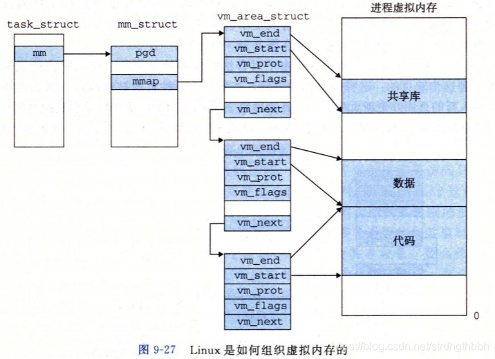

[toc]

# 练习0:填写已有实验
...略

# 练习1:给未被映射的地址映射上物理页
详细实现参考代码即可...  

- **请描述页目录项(Page Directory Entry)和页表项(Page Table Entry)中组成部分对ucore实现页替换算法的潜在用处**  
页目录项和页表项都占4字节(32位),由于他们保存的都是物理页号(只占用20bit),剩余12bit作为一些标志位,在页面置换中能用到的有:  
```
PTE_A:表示内存页是否被访问过
PTE_D表示内存页是否被修改过
```
这两个标志位可作为页面换出的参考之一;  
比如:未被修改换出时就不用复制到磁盘,直接修改物理内存也的Prensent标志即可

- **如果ucore的缺页服务例程在执行过程中访问内存,出现了页访问异常,请问硬件要做哪些事情?**  
这其实就是中断嵌套,所以和第一次发生缺页中断的处理流程一样.详见下面的讲解"补充:page fault异常处理"...  
=> 1.引发页访问异常的地址将被保存在cr2寄存器中; 2.CPU在当前内核栈保存当前被打断的程序现场,即依次压入当前被打断程序使用的EFLAGS、CS、EIP、errorCode; 3.int 0xE执行中断处理程序...


# 练习2:补充完成基于FIFO的页面替换算法
## FIFO页面置换
见代码处...
## extended clock页替换算法
- **算法设计**  
待完成...

- **需要被换出的页的特征是什么?**  
1.换出的页应该是近期没有被访问的页,这通过页表项中的PTE_A标志位判断;  
2.换出的时候应该优先换出没有修改的页,因为这样不用实际写到磁盘!这通过页表项中的PTE_D标志位判断;  
`什么时候设置标志位呢`? => 每次访问页面的时候(需要自己实现)

- **在ucore中如何判断具有这样特征的页?**  
见上一问  

- **何时进行换入和换出操作?**  
换入:发生缺页异常,发现页在磁盘没有在内存=> 换入到内存;  
换出:由页面置换算法决定...


# 补充:虚拟内存管理
## 基本原理概述
- **什么是虚拟内存**  
简单的说就是程序员或者CPU看到的内存  
(但也有的资料仅仅将磁盘上的swap解释为虚拟内存,稍作注意 => 推荐此处的解释)  
```
【虚拟内存的几种理解】
1.不考虑物理空间,只考虑虚拟地址空间,有人仅仅将虚拟地址空间对应的内存称为虚拟内存(比如64位的机器,虚拟内存大小则为2^64)
2.仅仅将磁盘上的swap理解为虚拟内存
3.将物理内存大小+磁盘大小(或者是swap大小)合起来看作虚拟内存
=> 具体语境具体分析...
```

- **几个注意之处**  
1.`虚拟内存单元不一定有实际的物理内存单元对应`(准确说是尚未给该虚拟地址分配物理内存),即实际的物理内存单元可能不存在;  
2.如果虚拟内存单元有实际的物理内存单元,那二者的地址一般是不相等的(即虚拟地址!=物理地址);  
3.通过操作系统实现的某种内存映射可建立虚拟内存与物理内存的对应关系,使得程序员访问的虚拟内存地址自动转换为一个物理内存地址;  

- **作用**  
页表完成虚拟地址到物理地址的转换 => 可通过设置页表项来限定软件运行时的访问空间,确保软件运行不越界,完成内存访问保护的功能(csapp也有讲述);  

- **按需分页**  
`通过内存地址虚拟化,可以使得软件在没有访问某虚拟内存地址时不分配具体的物理页,而只有在实际访问某虚拟内存地址时,操作系统再动态地分配物理内存,建立虚拟内存到物理内存的映射关系`  
```
【注】
不过对于内核而言,是直接一次分配所有需要的物理页,即使有很大一部分暂时并未使用.详见pmm.c的pm_init()中对boot_map_segment()的调用!
```

- **页面置换**  
`把不经常访问的数据所占的内存空间临时写到硬盘上`,从而腾出更多的物理内存给经常访问的数据;  
当CPU访问到不经常访问的数据时,再将这些数据从硬盘读取的内存中;  
换出的数据放到哪里?  
  


## 实验执行流程  
- **1.初始化**  
ucore的总控函数是kern_init()(见init.c)  
vmm前要完成的工作包括:pmm_init、pic_init、idt_init

- **2.虚拟内存管理**  
a. vmm_init() => 用于检查lab3练习1是否正确实现(当然包括执行练习1)  
b. ide_init() =>  为练习2做准备,完成对硬盘分区swap的初始化工作  
c. swap_init() => 为练习2做准备 ...  


## 关键数据结构 
- **linux虚拟内存的组织方式**  
ucore中组织虚拟内存的两个关键的数据结构与linux类似,如图所示:  
  
更多内容,参考博客:https://blog.csdn.net/strdhgthbbh/article/details/108868196 => 第9.7节
- **mm_struct**  
```
// the control struct for a set of vma using the same PDT
struct mm_struct {
    list_entry_t mmap_list;        // 链接mm_struct对应的所有vma_struct
    struct vma_struct *mmap_cache; // 指向当前正在使用的vma_struct
                                // 由于局部性原理,当前正在使用的虚拟地址空间接下来可能还会使用,这是就不需要查链表,而是直接使用这个之指针)
                                // 从而加快查询速度
    pde_t *pgdir;                  // the PDT of these vma => 指向mm_struct维护的页目录表
    int map_count;                 // the count of these vma => 记录mmap_list中链接的vma_struct的个数
    void *sm_priv;                   // the private data for swap manager => 指向用来链接记录页访问访问情况的链表头(从而建立了mm_struct和swap_mmanager之间的联系)
};
```

- **vma_struct**  
进程(虽然这里尚未谈到进程)的虚拟内存空间会被分成不同的若干区域,每个区域都有其相关的属性和用途,一个合法的地址总是落在某个区域当中的,这些区域也不会重叠.在linux内核中,这样的区域被称之为虚拟内存区域(virtual memory areas),简称vma.一个vma就是一块连续的线性地址空间的抽象,它拥有自身的权限(可读,可写,可执行等等),每一个虚拟内存区域都由一个相关的`struct vma_struct`结构来描述;  
一个 vma_struct其实就对应了一个段!  
```
// the virtual continuous memory area(vma), [vm_start, vm_end), 
// addr belong to a vma means  vma.vm_start<= addr <vma.vm_end 
struct vma_struct {
    struct mm_struct *vm_mm; // the set of vma using the same PDT 
    uintptr_t vm_start;      // start addr of vma ,PGSIZE对齐的      
    uintptr_t vm_end;        // end addr of vma, not include the vm_end itself,PGSIZE对齐的
    uint32_t vm_flags;       // flags of vma => VM_READ、VM_WRITE、VM_EXEC
    list_entry_t list_link;  // linear list link which sorted by start addr of vma => 将一系列用vma_struct表示的虚拟内存空间链接起来
};
```
- **原理概述**  
一般应用程序的对虚拟内存的"需求"与物理内存空间的"供给"没有直接的对应关系,`ucore是通过page fault异常处理来间接完成这二者之间的衔接`.page_fault函数不知道哪些是"合法"的虚拟页,原因是ucore还缺少一定的数据结构来描述这种不在物理内存中的"合法"虚拟页.为此ucore通过建立mm_struct和vma_struct数据结构,描述了ucore模拟应用程序运行所需的合法内存空间.当访问内存产生page fault异常时,可获得访问的内存的方式(读或写)以及具体的虚拟内存地址,这样ucore就可以查询此地址,看是否属于vma_struct数据结构中描述的合法地址范围中,如果在,则可根据具体情况进行请求调页/页换入换出处理;如果不在,则报错.  


# 补充:page fault异常处理  
当启动分页机制以后,如果一条指令或数据的虚拟地址所对应的物理页框不再内存中或者访问的类型有错误(比如写一个只读页或用户态程序访问内核态数据等),就会发生页访问异常.这部分主要涉及到函数do_pgfault()(见vmm.c)  

- **发生页访问异常的原因**  
1.`目标页帧不存在`(即页表项全为0,表示该线性地址/虚拟地址与物理地址尚未建立映射或者映射已经撤销);  
2.`相应的物理页帧不在内存中`(页表项非空但Present标志位=0,表示该页在swap分区或者磁盘文件中);  
3.`不满足访问权限`(Present标志位为1,但是低权限的程序视图访问高权限的地址空间,或者有程序试图写只读页面).  

- **保存异常地址与错误码**  
出现上述情况时,`CPU将产生异常的线性地址/虚拟地址存储在CR2寄存器`,并将表示页访问异常的errorCode保存到中断栈中  
```
[提示1]页访问异常错误码有32位.位0为1表示对应物理页不存在;位1为1表示写异常(比如写了只读页);位2为1表示访问权限异常(比如用户态程序访问内核空间的数据

[提示2]CR2是页故障线性地址寄存器,保存最后一次出现页故障的全32位线性地址.CR2用于发生页异常时报告出错信息.当发生页异常时,处理器把引起页异常的线性地址保存在CR2中,操作系统中对应的中断服务例程可以检查CR2的内容,从而查出线性地址空间中的哪个页引起本次异常
```

- **保存中断现场**  
由于页访问异常也是一种异常/中断,所以针对一般异常的硬件处理操作是必须要做的,即`CPU在当前内核栈保存当前被打断的程序现场,即依次压入当前被打断程序使用的EFLAGS、CS、EIP、errorCode`;由于页访问异常的中断号是0xE，CPU把异常中断号0xE对应的中断服务例程的地址(vectors.S中的标号vector14处)加载到CS和EIP寄存器中,开始执行中断服务例程.这时ucore开始处理异常中断,首先需要保存硬件没有保存的寄存器.在vectors.S中的标号vector14处先把中断号压入内核栈,然后再在trapentry.S中的标号__alltraps处把DS、ES和其他通用寄存器都压栈.自此,被打断的程序执行现场(context)被保存在内核栈中  

- **中断服务例程**  
保存中断现场后,由trap.c中的trap函数开始进入了中断服务例程的处理流程,调用过程如下:  
```
trap--> trap_dispatch-->pgfault_handler-->do_pgfault
```  
最后,do_pgfault的调用关系如图(见vmm.c):  
  


- **更多细节**  
产生页访问异常后,CPU把引起页访问异常的线性地址装到寄存器CR2中,并给出了出错码errorCode,说明了页访问异常的类型.ucore OS会把这个值保存在struct trapframe 的tf_err成员变量中.而中断服务例程会调用页访问异常处理函数do_pgfault进行具体处理.这里的页访问异常处理是实现按需分页、页换入换出机制的关键之处.  
ucore中do_pgfault函数是完成页访问异常处理的主要函数,它根据从CPU的控制寄存器CR2中获取的页访问异常的物理地址以及根据errorCode的错误类型来查找此地址是否在某个VMA的地址范围内以及是否满足正确的读写权限,如果在此范围内并且权限也正确,这认为这是一次合法访问,但没有建立虚实对应关系.所以需要分配一个空闲的内存页,并修改页表完成虚地址到物理地址的映射,刷新TLB,然后调用iret中断,返回到产生页访问异常的指令处重新执行此指令.如果该虚地址不在某VMA范围内，则认为是一次非法访问.  


# 补充:页面置换机制的实现 
## 页面替换算法  
...略  
参考:[第九讲:页面置换算法](https://blog.csdn.net/strdhgthbbh/article/details/109776877)
下面主要详细讨论页面置换机制的实现  

## 页面置换机制(重要)  
写在前面:实验三中仅实现了简单的页面置换机制,但现在还没有涉及实验四和实验五才实现的内核线程和用户进程,所以还无法通过内核线程机制实现一个完整意义上的虚拟内存页面置换功能.  

- **1.哪些页可以被换出?**  
`基本原则上`:只有映射到用户空间并且被用户程序直接访问的页才能被交换,`而被内核直接使用的内核空间的页面不能被换出`  
`为什么不能换出内核使用的页面`:保证操作系统的高效和实时  
```
但在实验三实现的ucore中,我们只是实现了换入换出机制,还没有设计用户态执行的程序,所以我们在实验三中仅仅通过执行check_swap函数在内核中分配一些页,模拟对这些页的访问,然后通过do_pgfault来调用swap_map_swappable函数来查询这些页的访问情况并间接调用相关函数,换出"不常用"的页到磁盘上.
```  

- **2.虚拟内存页如何与磁盘上的扇区建立映射关系?**  
`当一个PTE描述在内存中的页时`:PTE_P应该为1表示在内存中,且它还应该维护各种权限和 虚拟地址<=>物理地址 的映射关系;  
`当一个PTE描述在磁盘/swap的页时`:PTE_P应为0表示不在内存,且它还应该维护 虚拟地址<=> swap/磁盘上扇区 的映射关系;  
所以,当虚存访问的页不在内存中时,触发page fault => os根据PTE描述的swap向将相应的物理页建立起来,并根据虚存所描述的权限重新设置好PTE使得内存访问能够继续正常进行.  
当一个PTE描述swap/磁盘上的页时,页表项按照如下方式组织:  
```
*               swap_entry_t
* --------------------------------------------
* |         offset        |   reserved   | 0 |
* --------------------------------------------
*           24 bits            7 bits    1 bit
```
即高24bit用与表示此页在磁盘上的起始扇区号(0号扇区不使用!);中间7bit保留给后续扩展使用;最低1bit为0表示虚实地址映射关系不存在  
通常,一个页为4KB,一个扇区为512B,所以8个扇区对应一个页;在ucore中,使用第二个IDE硬盘保存被换出的扇区  

- **3.何时执行换入换出操作?**  
**换入时机**  
`当de_pgfault()函数判断出产生页访问异常的地址处于合法虚拟地址空间,且对应页保存在swap/磁盘中,则是执行页换入的时机` => 调用swap_in函数完成页面换入  
**换出时机**  
`积极换出策略`:操作系统周期性地主动将某些页面换出....  
`消极换出策略`:只有当试图得到空闲块且当前没有可供分配的物理页时,才执行换出  

- **4.页面替换算法对应的数据结构**  
为了表示物理页可被换出或已被换出的情况,对`Page`结构扩展如下:
```
struct Page {  
    ……   
    list_entry_t pra_page_link; //按页的第一次访问时间进行排序的一个链表,这个链表的开始表示第一次访问时间最近的页，链表结尾表示第一次访问时间最远的页
    uintptr_t pra_vaddr;        // pra_vaddr用来记录此物理页对应的虚拟页起始地址
};
```
当一个物理页(struct Page)需要被swap出去的时候,首先需要确保它已经分配了一个位于磁盘上的swap page(由连续的8个扇区组成).这里为了简化设计,在swap_check函数中建立了每个虚拟页唯一对应的swap page,其对应关系设定为:虚拟页对应的PTE的索引值 = swap page的扇区起始位置*8.  
为了实现各种页替换算法,ucore设计了一个页替换算法的类框架swap_manager:  
```
struct swap_manager  
{  
    const char *name;  
    /* Global initialization for the swap manager */  
    int (*init) (void);  
    /* Initialize the priv data inside mm_struct */  
    int (*init_mm) (struct mm_struct *mm);  
    /* Called when tick interrupt occured */  
    int (*tick_event) (struct mm_struct *mm);  
    /* Called when map a swappable page into the mm_struct */  
    int (*map_swappable) (struct mm_struct *mm, uintptr_t addr, struct Page *page, int swap_in);   
    /* When a page is marked as shared, this routine is called to delete the addr entry from the swap manager */
    int (*set_unswappable) (struct mm_struct *mm, uintptr_t addr);  
    /* Try to swap out a page, return then victim */  
    int (*swap_out_victim) (struct mm_struct *mm, struct Page *ptr_page, int in_tick);  
    /* check the page relpacement algorithm */  
    int (*check_swap)(void);   
};
```  
这里关键的两个函数指针是map_swappable和swap_out_vistim,前一个函数用于记录页访问情况相关属性,后一个函数用于挑选需要换出的页.显然第二个函数依赖于第一个函数记录的页访问情况.tick_event函数指针也很重要,结合定时产生的中断,可以实现一种积极的换页策略  

- **5.swap_check检查的实现**  
1.调用mm_create建立mm变量,并调用vma_create创建vma变量,设置合法的访问范围为4KB~24KB;  
2.调用free_page等操作,模拟形成一个只有4个空闲 physical page;并设置了从4KB~24KB的连续5个虚拟页的访问操作;  
3.设置记录缺页次数的变量pgfault_num=0,执行check_content_set函数,使得起始地址分别对起始地址为0x1000, 0x2000, 0x3000, 0x4000的虚拟页按时间顺序先后写操作访问,由于之前没有建立页表,所以会产生page fault异常,如果完成练习1,则这些从4KB~20KB的4虚拟页会与ucore保存的4个物理页帧建立映射关系;  
4.然后对虚页对应的新产生的页表项进行合法性检查;  
5.然后进入测试页替换算法的主体,执行函数check_content_access,并进一步调用到_fifo_check_swap函数,如果通过了所有的assert,这进一步表示FIFO页替换算法基本正确;  
6.最后恢复ucore环境

# 补充:slob内存分配算法(slab的简化版)
见lab8/memo-cdz/review_all_Q&A.md


# 相关要点/问题速览
- **全局变量boot_cr3与全局变量boot_pgdir的区别于联系**  
1.两者都是供内核使用的,所有内核线程都是使用这两个变量提供的页(目录)表信息;  
2.boot_cr3是一级页表的物理地址,而boot_pgdir是一级页表的虚拟地址;  
3.boot_cr3可通过boot_pgdir计算得到,此外boot_cr3会保存在cr3寄存器中;  
4.`ucore内核中的所有线程都不需要再建立各自的页表,只需共享内核虚拟空间boot_pgdir就可以访问整个内核的物理内存空间`;而用户线程需要建立自己的页表;  
(...详见pmm.c)


- **当程序运行中访问内存产生page fault异常时,如何判定这个引起异常的虚拟地址内存访问是越界、写只读页的"非法地址"访问还是由于数据被临时换出到磁盘上或还没有分配内存的"合法地址"访问?**  
详见vmm.c/do_pgfault()下面有详细的注释  


- **何时进行请求调页/页换入换出处理?**  
换入:请求的页面在磁盘而不在内存时;  
换出:通常是进程占用的物理内存过多时;  
`!!!注`:对于ucore而言,默认并未设置用户进程换出/换入;  只是在alloc_pages()、do_pgfault()两个函数中有换出/换入的相关测试代码(建立了一个不属于任何进程的虚假mm_struct来测试=> 见swap.c/check_mm_struct)  


- **哪些情况下会发生pgfault?**  
1.`目标页帧不存在`(即页表项全为0,表示该线性地址/虚拟地址与物理地址尚未建立映射或者映射已经撤销);  
2.`不满足访问权限`(Present标志位为1,但是低权限的程序视图访问高权限的地址空间,或者有程序试图写只读页面).  
3.`相应的物理页帧不在内存中`(页表项非空但Present标志位=0,表示该页在swap分区或者磁盘文件中);  
  

- **为什么要使用mm_create()动态分配物理内存(见vmm.c)?**  
1.直接创建是在栈上分配,函数退出后就不能被访问.而动态分配在堆上,函数退出后还可继续使用;  
2.当然也可以选择让需要的mm_struct是全局变量,既不再堆上,也不在栈上,而是在特定的内存段上!  
3.但是全局变量导致不能按需释放,不会再次使用的mm_struct也得占用内存空间  


- **理解do_pgfault()函数=>很重要**  
很重要,理解其中switch逻辑、以及switch后续处理的含义...  
详见vmm.c(看lab8中完整的代码注释)  

- **页目录表和页表保存的是物理地址还是物理页号?查找页表的过程?**  
是物理页号  
对于虚拟地址la共32位: | PDX(10) | PTX(10) | PGOFF(12) |,虚拟地址的前20bit就是用来查找该地址所在物理页号的;  
1.首先查找页目录表的第PDX个表项,得到二级页表的物理页号,从而找到二级页表;  
2.再查找二级页表的第PTX个表项,得到虚拟地址la所在页的物理页号;  
`物理页号只占20bit(因为页大小占了12bit),那么多余的字节的用处是什么呢?`  
页目录表项和页表项的低12bit是一些标志位,给出了该页的一些信息,如下(kern/mm/mmu.h)  
```
/* page table/directory entry flags */
#define PTE_P           0x001                   // Present
#define PTE_W           0x002                   // Writeable
#define PTE_U           0x004                   // User
#define PTE_PWT         0x008                   // Write-Through
#define PTE_PCD         0x010                   // Cache-Disable
#define PTE_A           0x020                   // Accessed
#define PTE_D           0x040                   // Dirty
......
```  

- **如何通过虚拟地址对内存访问做权限控制?**  
使用虚拟地址以后,很大一部分权限控制是直接在虚拟地址上限定的,比如读、写、执行权限等  
实现方式 => `以虚拟地址段为单位,每次访问时检查该虚拟段的权限`,这是根据vma_struct的成员vm_flags控制!  
```
struct vma_struct {
    struct mm_struct *vm_mm; // the set of vma using the same PDT 
    uintptr_t vm_start;      // start addr of vma ,PGSIZE对齐的      
    uintptr_t vm_end;        // end addr of vma, not include the vm_end itself,PGSIZE对齐的
    uint32_t vm_flags;       // flags of vma => VM_READ、VM_WRITE、VM_EXEC
    list_entry_t list_link;  // linear list link which sorted by start addr of vma => 将一系列用vma_struct表示的虚拟内存空间链接起来
};
```  

- **如何在物理内存页层面对内存访问做权限控制(结合虚拟内存段一起控制权限)?**  
`通过页表项`:页表项剩余12bit用作标志位,其中部分为可用于控制该页的权限(mmu.h):  
```
#define PTE_P           0x001                   // Present
#define PTE_W           0x002                   // Writeable
#define PTE_U           0x004                   // User
#define PTE_PWT         0x008                   // Write-Through
#define PTE_PCD         0x010                   // Cache-Disable
......
```

- **进程如何知道哪些属于该进程的页面在物理内存中(重要)?**  
通过`proc_struct -> mm_struct ->sm_priv`!  
sm_priv是一个链表的头结点,这个链表链接的是一系列Page结构体,他们对应该进程在内存中的页面!!!  

- **如何理解check_pgfault()中的如下两条语句?**  
```
代码见vmm.c
page_remove(pgdir, ROUNDDOWN(addr, PGSIZE));
free_page(pde2page(pgdir[0]));
pgdir[0] = 0;
```
??
