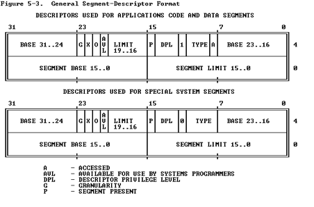
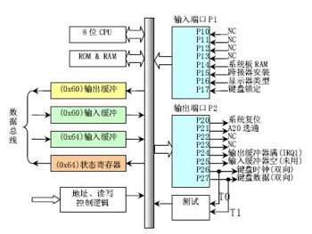
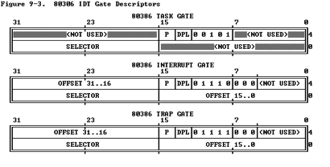

[TOC]

# 关于本project
- ./boot :bootloader相关代码  
- ./bios-bootloader.s：自己导出的qemu执行的指令，包括bios、bootloader  


# 练习1
相关笔记见Makefile文件
- **操作系统镜像文件ucore.img是如何一步一步生成的?**  
详见Makefile中,目标文件$(UCOREIMG)的生成规则  

- **一个被系统认为是符合规范的硬盘主引导扇区的特征是什么**  
由于bootloader必须符合主引导扇区的特征,可参考MakeFile中目标文件$(bootblock)的生成规则找到=>  
生成bootloader时使用了sign程序,查看源码可知,它将bootloader填充至`512字节,且末尾两字节是0x55、0xAA`

# 练习2:使用qemu执行并调试
- **关于开机启动的第一条指令**  
参考:[4.10 补充：关于第一条指令及线性地址的计算](https://blog.csdn.net/strdhgthbbh/article/details/109059645)  
以及下面的补充...
- **如何一次查看所有执行的指令**  
=> qemu的启动选项加上：-d in_asm -D  bootasm.s,将执行的指令输出到指定文件
- **bios、bootloader更多细节**  
参考导出的qemu执行过程:bios-bootloader.s

# 练习3:分析bootloader进入保护模式的过程
- **为何开启A20、以及如何开启A20**  
为了在24/32条地址线的机器上,16位实模式下能够自动回绕1M以上的那小部分地址.286、386默认关闭了A20;  
保护模式下,为了正常使用高于1M的地址,必须开启A20;  
`开启方法`:见下文A20 Gate部分讲解以及bootloader.S代码中的注释(参考lab8中代码!)  

- **如何初始化GDT表**  
见bootasm.S代码:
```
gdt:
    SEG_NULLASM                                     # null seg  => 第一个段描述符设定为空段描述符
    SEG_ASM(STA_X|STA_R, 0x0, 0xffffffff)           # code seg for bootloader and kernel
    SEG_ASM(STA_W, 0x0, 0xffffffff)                 # data seg for bootloader and kernel

# 描述全局描述符表的描述符 => 实际上它就是GDTR的内容 
#   .word 0x17  #写入段描述符表的长度 => 为什么是23而不是24? 因为按照地址算是gdt+0,gdt+1,....gdt+23,正好是24字节
#   .long gdt   #写入段描述符表gdt的地址
gdtdesc:
    .word 0x17                                      # sizeof(gdt) - 1 => .word伪指令:在当前位置放置一个16bit的字...
    .long gdt                                       # address gdt     => .long伪指令:.....

```
gdt是在编译期就完成静态初始化,第一个段描述符为空,目前只设置了代码段和数据段;  
此外还需要设置gdtdesc,它是GDTR中的内容,包括gdt的长度和地址,在使能保护模式时会加载这部分数据到GDTR(lgdt gdtdesc),详见bootasm.S  

- **如何使能和进入保护模式**  
代码见bootasm.S 
```
  lgdt gdtdesc                                    # lgdt指令:加载全局描述符表
  movl %cr0, %eax                                 # 从cr0加载32位长字到eax寄存器,修改寄存器内容
  orl $CR0_PE_ON, %eax                            # or指令:进行逻辑或,结果放入目的操作数 => 保证PE位为1
  movl %eax, %cr0                                 # 将设置好后的内容放入CR0,开启保护模式

  # 设置好保护模式后,下一条指令应该是32位保护模式的计算方式(CS寄存器的隐形部分+EIP)
  # => 所以这条指令会将CS寄存器设置为PROT_MODE_CSEG(然后将对应的基址读取到CS不可见部分);   EIP设置为protcseg
  ljmp $PROT_MODE_CSEG, $protcseg                 # ljmp 段选择子,段内偏移 => ljmp 0x8,protcseg
```
经过上面的跳转后,正式进入32位保护模式代码！


# 练习4:分析bootloader加载ELF格式的OS的过程
- **bootloader如何读取硬盘扇区的?**  
通过读写磁盘的IO端口来读取硬盘数据,详见bootmain.c
- **bootloader是如何加载ELF格式的OS?**  
首先找到ucore程序的elfhdr,根据其中的信息读取所有段到内存,详见bootmain.c

# 练习5:实现函数调用堆栈跟踪
- **...并解释最后一行各个数值的含义**  
代码详见kdebug.c; 最后一行如下:
```
ebp:0x00007bf8 eip:0x00007d73 args:0xc031fcfa 0xc08ed88e 0x64e4d08e 0xfa7502a8
```
最后一行对应第一个使用堆栈的函数,即bootmain()函数;  
bootloader设置的堆栈从0x7c00开始,使用"call bootmain"转入bootmain函数,call指令压栈,所以bootmain中ebp为0x7bf8;  
`最后一行ebp为什么是0x7bf8`,解释如下:
```
|  栈底方向     |   高位地址
-----------------             => 最开始设置的栈顶:0x7c00,然后调用bootmain
|  返回地址     |              => 地址0x7bfc(bootmain没有参数,直接返回地址最先入栈)
|  上一层[ebp]  |              => [ebp],据此形成了函数调用链.这里地址就是0x7bf8,由于bootloader中ebp设置为0,所以这里存储的值就是0! 
|  局部变量     |
|    ...       |  
-----------------
|    ...       |
|   参数3       |
|   参数2       |
|   参数1       |
|  返回地址     |
|  上一层[ebp]  | 
|  局部变量     |
|    ...       |  低位地址
-----------------   
    栈顶方向
    .....
```

# 练习6:完善中断初始化和处理
- **1.中断描述符表(也可简称为保护模式下的中断向量表)中一个表项占多少字节?其中哪几位代表中断处理代码的入口?**  
IDT中一个表项目占8字节;由中断门描述符的格式可知,2、3字节是段选择子,0、2、6、7字节是段偏移,据此可找到中断处理代码的入口地址.
- **2.请编程完善kern/trap/trap.c中对中断向量表进行初始化的函数idt_init**  
详见trap.c  
- **3.请编程完善trap.c中的中断处理函数trap...**  
详见trap.c  

- **注意**  
【注意】`除了系统调用中断(T_SYSCALL)使用陷阱门描述符且权限为用户态权限以外,其它中断均使用特权级(DPL)为0的中断门描述符,权限为内核态权限`;  
而ucore的应用程序处于特权级3,需要采用`int 0x80`指令操作(这种方式称为`软中断`,软件中断,Tra中断,在lab5会碰到)来发出系统调用请求,并要能实现从特权级3到特权级0的转换,所以系统调用中断(T_SYSCALL)所对应的中断门描述符中的特权级(DPL)需要设置为3  


# 补充:BIOS启动过程(关于开机第一条指令),非常重要
- **以80386为例**  
以Intel 80386为例,计算机加电后,CPU从物理地址0xFFFFFFF0(由初始化的CS:EIP确定,此时CS和IP的值分别是0xF000和0x0000FFF0,注意,32位下CS还有隐藏部分为0xFFFF0000)开始执行.在`0xFFFFFFF0这里只是存放了一条跳转指令,通过跳转指令跳到BIOS例行程序起始点(F000:E05B)`.BIOS做完计算机硬件自检和初始化后,会选择一个启动设备(例如软盘、硬盘、光盘等),并且读取该设备的第一扇区(即主引导扇区或启动扇区)到内存一个特定的地址`0x7c00(bootloader起始地址)`处,然后CPU控制权会转移到那个地址继续执行.至此BIOS的初始化工作做完了,进一步的工作交给了ucore的bootloader.

- **向后兼容**  
`16位的8086 CPU时代`:内存限制在1MB范围内,且BIOS的代码固化在EPROM中.在基于Intel的8086 CPU的PC机中的EPROM被编址在1MB内存地址空间的最高64KB中.PC加电后,`CS寄存器初始化为0xF000,IP寄存器初始化为0xFFF0,所以CPU要执行的第一条指令的地址为CS:IP=0xF000:0XFFF0(Segment:Offset 表示)=0xFFFF0(Linear表示)`.这个地址位于被固化EPROM中,该地址处的指令是一个长跳转指令`JMP F000:E05B(BIOS起始地址)`,这样就开启了BIOS的执行过程.  
  
`32位的80386 CPU时代`:内存空间扩大到了4G,多了段机制和页机制,但Intel依然很好地保证了80386向后兼容8086.地址空间的变化导致无法直接采用8086的启动约定.如果把BIOS启动固件编址在0xF000起始的64KB内存地址空间内,就会把整个物理内存地址空间隔离成不连续的两段,一段是0xF000以前的地址,一段是1MB以后的地址(`就是说不想让BIOS ROM夹在两段RAM之间`),这很不协调.为此,intel采用了一个折中的方案:`默认将执行BIOS ROM编址在32位内存地址空间的最高端,即位于4GB地址的最后一个64KB内`.在PC系统开机复位时,CPU进入实模式,并将CS寄存器设置成0xF000,将它的shadow register的Base值初始化设置为0xFFFF0000,EIP寄存器初始化设置为0x0000FFF0.所以机器执行的第一条指令的物理地址是0xFFFFFFF0(如何计算:对于32位而言,就是CS隐藏部分+IP).80386的BIOS代码也要和以前8086的BIOS代码兼容，故地址0xFFFFFFF0处的指令还是一条长跳转指令`jmp F000:E05B`.注意,这个长跳转指令会触发更新CS寄存器和它的shadow register，即执行`jmp F000 : E05B后，CS将被更新成0xF000.表面上看CS其实没有变化,但CS的shadow register被更新为另外一个值了,它的Base域被更新成0x000F0000,此时形成的物理地址为Base+EIP=0x000FE05B,这就是CPU执行的第二条指令的地址`.此时这条指令的地址已经是1M以内了,且`此地址不再位于BIOS ROM中,而是位于RAM空间中`.由于Intel设计了一种映射机制,将内存高端的BIOS ROM映射到1MB以内的RAM空间里,并且可以使这一段被映射的RAM空间具有与ROM类似的只读属性.所以PC机启动时将`开启这种映射机制,让4GB地址空间的最高一个64KB的内容等同于1MB地址空间的最高一个64K的内容`,从而使得执行了长跳转指令后,其实是回到了早期的8086 CPU初始化控制流,保证了向下兼容.

# 补充:bootloader启动过程
## 保护模式和分段机制
### 实模式
将整个物理内存看做分段的区域....,`修改A20地址线可完成从实模式到保护模式的切换`

### 保护模式
只有在保护模式下,80386的全部32根地址线有效,可寻址高达4G字节的线性地址空间和物理地址空间,可访问64TB(有2^14个段,每个段最大空间为2^32字节)的逻辑地址空间,可采用分段存储管理机制和分页存储管理机制.`通过提供4个特权级和完善的特权检查机制,既能实现资源共享又能保证代码数据的安全及任务的隔离`.  
地址转换过程:逻辑地址 => 线性地址 => 物理地址(需要使用GDT、LDT)  
**注意**:`保护模式下,汇编指令中的地址是逻辑地址(即操作系统中所称的虚拟地址)`
```
【补充】保护模式下,有两个段表:GDT和LDT,每一张段表可以包含8192(2^13)个描述符,因而最多可以同时存在2 * 2^13 = 2^14个段.虽然保护模式下可以有这么多段,逻辑地址空间看起来很大,但实际上段并不能扩展物理地址空间,很大程度上各个段的地址空间是相互重叠的.目前所谓的64TB（2^(14+32)=2^46）逻辑地址空间是一个理论值,没有实际意义.在32位保护模式下,真正的物理空间仍然只有2^32字节那么大.注:在ucore lab中只用到了GDT,没有用LDT.
```

### 分段机制
地址转换过程..... => 需要使用:段选择子(CS寄存器)、段描述符表、描述符表寄存器  
分段相关内容中的段描述符、段描述符表可以参考源码:bootasm.S、mmu.h、pmm.c  
`这里所说的分段与编译器中描述的代码段、数据段、堆栈段含义是一致的`  

- **段描述符**  
段描述符表中的一个数据项,包括:段基址、段限长、段属性  
详见./kern/mm/mmu.h中的segdesc数据结构!!  
段描述符格式如下,注意基址、限长的各个bit并不是连续的!!  


- **全局描述符表GDT**  
由段描述符构成的数组  
其起始地址保存在全局描述符表寄存器`GDTR`中  
第一个段描述符设定为空段描述符  
**注**:`GDT存放的不止代码段、数据段描述符;还可以存放很多其他信息,比如调用门描述符、TSS(任务状态段描述符)等`  
详见./boot/bootasm.S 和 kern/mm/pmm.c

- **段选择子**  
`CS/DS段的程序员可见部分,16位`;(不止CS/DS中有段选择子;TR等寄存器也有,TR寄存器用于检索TSS段)  
低2位描述特权级 => 对DS而言是请求特权级(RPL); 对CS而言是当前特权级(CPL)  
低3位用于选择段描述符表(0:GDT、1:LDT)  
`高13位:到段描述符表的索引`(通过该索引在段描述符表中查找段描述符 => 共2^13=8192个表项)  
  

- **地址转换**  
1.分段地址转换:CPU把`逻辑地址`(由段选择子selector和段偏移offset组成)中的段选择子的内容作为段描述符表的索引,找到表中对应的段描述符,然后把段描述符中保存的段基址加上段偏移值,形成线性地址(Linear Address).如果不启动分页存储管理机制,则线性地址等于物理地址.  
2.分页地址转换:这一步中把线性地址转换为物理地址.(注意:这一步是可选的,由操作系统决定是否需要)  


### 特权级
在保护模式下,特权级总共有`4个,编号从0到3`(高到低);  
`3种主要的资源受到保护:内存、I/O端口、执行特殊机器指令的能力`;  
在任一时刻,x86 CPU都是在一个特定的特权级下运行的,这些特权级经常被称为为保护环.最外面的环(ring 3)一般给应用程序使用,对应最低特权3.在ucore中,CPU只用到其中的2个特权级:0(内核态)和3(用户态); 有`大约15条机器指令被CPU限制只能在内核态执行`,如果企图在ring 0以外运行这些指令,就会导致一个一般保护异常(general-protection exception).对内存和I/O端口的访问也受类似的特权级限制;  
数据段选择子的整个内容可由程序直接加载到各个段寄存器(如SS或DS等)当中.`这些内容里包含了请求特权级(Requested Privilege Level,简称RPL)`字段; 然而,代码段寄存器(CS)的内容不能由装载指令(如MOV)直接设置,而只能被那些会改变程序执行顺序的指令(如JMP、INT、CALL)间接地设置.而且`CS拥有一个由CPU维护的当前特权级字段(Current Privilege Level,简称CPL)`.二者结构如下图所示:  

**注**:`代码段寄存器中的CPL字段(2位)的值总是等于CPU的当前特权级`,所以只要看一眼CS中的CPL,就可以知道此刻的特权级了.  
 
- **特权级检查过程**  
`CPU会在两个关键点上保护内存:当一个段选择符被加载时、当通过线性地址访问一个内存页时.`;  
因此,保护也反映在内存地址转换的过程之中,既包括分段又包括分页.当一个数据段选择符被加载时,就会发生下述的检测过程:  

越高的数值代表越低的特权,上图中的MAX()用于选择CPL和RPL中特权最低的一个,并与描述符特权级(Descriptor Privilege Level,简称`DPL`)比较.如果DPL的值大于等于它,那么这个访问可正常进行了.`RPL背后的设计思想是:允许内核代码加载特权较低的段`.比如,可以使用RPL=3的段描述符来确保给定的操作所使用的段可以在用户模式中访问.但`堆栈段寄存器是个例外,它要求CPL、RPL和DPL这3个值必须完全一致,才可以被加载`

- **三类特权级小结**  
**CPL**:当前特权级(Current Privilege Level)保存在CS段寄存器(选择子)的最低两位,`CPL就是当前活动代码段的特权级`,并且它定义了当前所执行程序的特权级别 => 它就是cpu的特权级;  
**DPL**:描述符特权(Descriptor Privilege Level)存储在段描述符中的权限位,用于描述对应段(代码段、数据段、任务段...)所属的特权等级,也就是`段本身能被访问的真正特权级`.正常的情况下,当程序的环境建立好后,段描述符都不需要改变——当然DPL也不需要改变.  
**RPL**:请求特权级(Request Privilege Level)保存在选择子的最低两位.RPL说明的是`进程对段访问的请求权限`,意思是当前进程想要的请求权限.`RPL的值可自由设置,并不一定要求RPL>=CPL`,但是当RPL < CPL时,实际起作用的就是CPL了,因为访问时的特权级保护检查要判断max(RPL,CPL)<=DPL是否成立.所以RPL可以看成是每次访问时的附加限制,RPL=0时附加限制最小,RPL=3时附加限制最大.

## 地址空间
- **物理地址空间**  
物理地址空间(在很多地方,这里所说的物理地址空间实际上被称为虚拟地址空间!)的大小取决于CPU实现的物理地址位数,在基于80386的计算机系统中,CPU的物理地址空间为4GB(32位);  
如果计算机系统实际上有1GB物理内存(<=物理地址空间大小),而其他硬件设备的IO寄存器映射到起始物理地址为3GB的256MB大小的地址空间,则该计算机系统的物理地址空间如下所示:
```
+------------------+  <- 0xFFFFFFFF (4GB)
|     无效空间      |
|                  |
+------------------+  <- addr:3G+256M
|     256MB        |
|   IO外设地址空间   |
|                  |
+------------------+  <- 0xC0000000(3GB)
|                  |
/\/\/\/\/\/\/\/\/\/\

/\/\/\/\/\/\/\/\/\/\
|     无效空间      |
+------------------+  <- 0x40000000(1GB)
|                  |
|    实际有效内存    |
|                  |
+------------------+  <- 0x00100000 (1MB)
|     BIOS ROM     |
+------------------+  <- 0x000F0000 (960KB)
|  16-bit devices, |
|  expansion ROMs  |
+------------------+  <- 0x000C0000 (768KB)
|   VGA Display    |
+------------------+  <- 0x000A0000 (640KB)
|                  |
|    Low Memory    |
|                  |
+------------------+  <- 0x00000000
```

- **地址转换**  
启动分段机制,未启动分页机制:逻辑地址--> (分段地址转换) -->线性地址==物理地址
启动分段和分页机制:逻辑地址 --> (分段地址转换) --> 线性地址 --> (分页地址转换) --> 物理地址

## A20 Gate
- **原理概述**  
Intel早期的8086 CPU提供了20根地址线,可寻址空间范围即0~2^20(00000H~FFFFFH)的 1MB内存空间.但8086的数据处理位宽位16位,无法直接寻址1MB内存空间,所以8086提供了段地址加偏移地址的地址转换机制.PC机的寻址结构是segment:offset,segment和offset都是16位的寄存器,最大值是0ffffh,换算成物理地址的计算方法是把segment左移4位,再加上offset,所以`segment:offset所能表达的寻址空间最大应为0ffff0h + 0ffffh = 10ffefh > 1M`(前面的0ffff0h是segment=0ffffh并向左移动4位的结果,后面的0ffffh是可能的最大offset).可见,segment:offset的地址表示能力,超过了20位地址线的物理寻址能力.所以当寻址到超过1MB的内存时,会发生`回卷`(不会发生异常,只是自动从0开始计算地址).  
但下一代的基于Intel 80286 CPU的PC AT计算机系统提供了24根地址线,这样CPU的寻址范围变为 2^24=16M,同时也提供了保护模式,可以访问到1MB以上的内存了,此时如果遇到"寻址超过1MB"的情况,系统不会再"回卷"了,这就造成了向下不兼容.为了保持完全的向下兼容性,IBM决定在PC AT计算机系统上`加个硬件逻辑,来模仿以上的回绕特征,于是出现了A20 Gate`.他们的`方法就是把A20地址线(即第21根线)控制和键盘控制器的一个输出进行AND操作,这样来控制A20地址线的打开(使能)和关闭(屏蔽\禁止)`.一开始时A20地址线控制是被屏蔽的(总为0),直到系统软件通过一定的IO操作去打开它(参看bootasm.).很显然,在实模式下要访问高端内存区,这个开关必须打开;在保护模式下,由于使用32位地址线,如果A20恒等于0,那么系统只能访问奇数兆的内存，即只能访问0--1M、2-3M、4-5M......(A0~A19对应1MB空间),这样无法有效访问所有可用内存.所以在保护模式下,这个开关也必须打开.  
在保护模式下,为了使能所有地址位的寻址能力,需要打开A20地址线控制,即需要通过向键盘控制器8042发送一个命令来完成.键盘控制器8042将会将它的的某个输出引脚的输出置高电平,作为A20地址线控制的输入.一旦设置成功之后,内存将不会再被绕回(memory wrapping),这样我们就可以寻址整个286的16M内存,或者是寻址80386级别机器的所有4G内存了!  

- **8042**  
键盘控制器8402结构如图所示:  
  
早期的PC机,控制键盘有一个单独的单片机8042,现如今这个芯片已经给集成到了其它大片子中,但其功能和使用方法还是一样.当PC机刚刚出现A20 Gate的时候,估计为节省硬件设计成本,工程师使用这个8042键盘控制器来控制A20 Gate,但`A20 Gate与键盘管理没有一点关系`.  
8042键盘控制器的IO端口是0x60～0x64,实际上IBM PC/AT`使用的只有0x60和0x64两个端口`(0x61、0x62和0x63用于与XT兼容目的).8042通过这些端口给键盘控制器或键盘发送命令或读取状态.输出端口P2用于特定目的.位0(P20引脚)用于实现CPU复位操作,`位1(P21引脚)用于控制A20信号线的开启与否`.系统向端口0x64写入一个字节,即发送一个键盘控制器命令.可以带一个参数.参数是通过0x60端口发送的,命令的返回值也从端口0x60去读.  
注:对外设而言,寄存器就是端口,而且`多个寄存器可能共用一个端口`;`在8042中,状态寄存器和控制寄存器(命令输入)地址都是0x64,(数据)输入缓冲寄存器和输出缓存寄存器都是0x60`;这里的0x60、0x64都是外部端口!
8042有4个寄存器:  
````
.1个8-bit长的Input buffer:Write-Only;     => 地址:0x60,数据输入
.1个8-bit长的Output buffer:Read-Only;     => 地址:0x60,输入输出
.1个8-bit长的Status Register:Read-Only;   => 地址:0x64,状态寄存器(用于输出,见上图)
.1个8-bit长的Control Register:Read/Write; => 地址:0x64,控制寄存器(用于命令输入,图中仍然标的是输入缓冲!!!)

所以,有关读写的情况如下:  
.读60h端口,读output buffer
.写60h端口,写input buffer
.读64h端口,读Status Register
.操作Control Register,首先要向64h端口写一个命令(20h为读命令,60h为写命令),然后根据命令从60h端口读出Control Register的数据或者向60h端口写入Control Register的数据(64h端口还可以接受许多其它的命令)
````
除了这些资源外,`8042还有3个内部端口(图中右侧蓝绿色)`:Input Port、Outport Port和Test Port,这三个端口的操作都是通过向64h发送命令,然后在60h进行读写的方式完成,其中`本文要操作的A20 Gate被定义在Output Port的bit 1上`,所以有必要对Outport Port的操作及端口定义做一个说明:  
```
.读Output Port:向64h发送0d0h命令,然后从60h读取Output Port的内容
.写Output Port:向64h发送0d1h命令,然后向60h写入Output Port的数据
.禁止键盘操作命令:向64h发送0adh
.打开键盘操作命令:向64h发送0aeh
```
- **开启A20 Gate**  
有了上述命令和知识,就可以实现操作A20 Gate来从实模式切换到保护模式了.理论上讲,我们只要操作8042芯片的输出端口(64h)的bit 1,就可以控制A20 Gate,但`实际上,当你准备向8042的输入缓冲区里写数据时,可能里面还有其它数据没有处理,所以,我们要首先禁止键盘操作,同时等待数据缓冲区中没有数据以后,才能真正地去操作8042打开或者关闭A20 Gate`.打开A20 Gate的具体步骤大致如下(参考bootasm.S):
```
1.等待8042 Input buffer为空;                                          => 这个input buffer指命输入命令的缓冲,即控制寄存器,0x64
2.发送Write 8042 Output Port(P2)命令到8042 Input buffer;              => 发送写内部端口Output Port的命令给控制寄存器0x64(这一过程就是将0xd1写到控制寄存器0x64)
3.等待8042 Input buffer为空;                                          => 等待0x64空(同1都是为了防止有其他命令在执行)
4.将8042 Output Port(P2)得到字节的第2位置1,然后写入8042 Input buffer;   => 2中发送命令后,Output Port的数据应该会复制到0x60,然后修改0x60端口的数据(bit1),自动设置到内部寄存器Output Port(个人猜测?)
```

## 硬盘访问概述
- **IDE**  
IDE即"电子集成驱动器",它的本意是指把"硬盘控制器"与"盘体"集成在一起的硬盘驱动器.一般每个主板上有两个IDE接口/通道(IDE1和IDE2).每个接口可以分别接两个硬盘或者两个光驱.在机箱内主板上连接硬盘和光驱的接口就是IDE接口
第一个IDE通道通过访问IO地址0x1f0~0x1f7来实现
第二个IDE通道通过访问IO地址0x170~0x17f来实现
每个通道的主从盘通过第6个IO偏移地址寄存器来设置(对第一个IDE接口来说,寄存器就是0x1f6)
IDE几个寄存器详情参考:[磁盘IO地址和对应功能](https://chyyuu.gitbooks.io/ucore_os_docs/content/lab1/lab1_3_2_3_dist_accessing.html)

- **硬盘的LBA模式和CHS模式**  
CHS(Cylinder Head Sector)
LBA(Logical Block Addressing)
二者代表对磁盘的不同编址方式,详见:[硬盘LBA 和CHS的关系](https://blog.csdn.net/zztan/article/details/70861021?utm_medium=distribute.pc_relevant.none-task-blog-title-3&spm=1001.2101.3001.4242)

- **ucore如何实现硬盘访问**  
ucore的bootloader访问硬盘采用LBA模式的PIO(Program IO)方式来加载OS,即`所有的IO操作都是通过CPU访问硬盘的IO地址寄存器来完成(而不是DMA)`;  
一个扇区大小为512B,读取一个扇区流程(详见./boot/bootmain.c中readsect函数):  
1.等待磁盘准备好  
2.发出读取扇区命令  
3.等待磁盘准备好  
4.把磁盘扇区数据读到指定内存

## ELF文件格式概述
- **三种ELF文件**  
可重定位目标文件 => xxx.o  
可执行目标文件 => a.out  
共享目标文件   => xxx.so

- **ELF可执行目标文件格式(重要)**  
`elf header`在文件开始处描述了整个文件的组织.ELF的文件头包含整个执行文件的控制结构.其定义在elf.h中:
```
struct elfhdr {
	uint32_t e_magic;	        // 魔数，elf文件的前四字节分别为（0x7f，E，L，F）
	uint8_t e_elf[12];        //这12字节没有定义
	uint16_t e_type;         //目标文件属性
	uint16_t e_machine;       //硬件平台类型
	uint32_t e_version;       //elf的版本
	uint32_t e_entry;        //程序入口
	uint32_t e_phoff;        //段头部表相对于文件起始地址的偏移
	uint32_t e_shoff;        //节头部表相对于文件起始地址的偏移
	uint32_t e_flags;        //处理器特定标志 
	uint16_t e_ehsize;       //elf头部长度 
	uint16_t e_phentsize;    //段头部表中一个条目的长度 
	uint16_t e_phnum;        //段头部表条目数目 
	uint16_t e_shentsize;    //节头部表中一个条目的长度 
	uint16_t e_shnum;        //节头部表条目个数 
	uint16_t e_shstrndx;    //节头表字符索引 
};
```
`program header`描述与程序执行直接相关的目标文件结构信息,`用来在文件中定位各个段的映像`,同时包含其他一些用来为程序创建进程映像所必需的信息.可执行文件的程序头部是一个program header结构的数组,每个结构描述了一个段或者系统准备程序执行所必需的其它信息,目标文件的"段"包含一个或者多个 "节区"(section),也就是"段内容(Segment Contents)".程序头部仅对于可执行文件和共享目标文件有意义.可执行目标文件在ELF头部的e_phentsize和e_phnum成员中给出其自身程序头部的大小.程序头部的数据结构如下表所示:
```
struct proghdr {
  uint type;   // 段类型
  uint offset;  // 段相对文件头的偏移值
  uint va;     // 段的第一个字节将被放到内存中的虚拟地址
  uint pa;
  uint filesz;
  uint memsz;  // 段在内存映像中占用的字节数
  uint flags;
  uint align;
};
```
`elf可执行文件的完整格式如下`:

`上文中的elf header即ELF头;program header即段头部表`


# 补充:操作系统启动过程
## 启动过程概述
bootloader将ucore将在到内存后,就跳转到ucore在内存中的入口位置(跳转见bootmain.c,ELF头中有入口地址)  
这个入口地址就是:./kern/init/init.c中的kern_init函数的起始地址;之后主要完成的工作为:  
- 初始化终端
- 显示字符串
- 显示堆栈中的多层函数调用关系
- 切换到保护模式,启用分段机制
- `初始化中断控制器,设置中断描述符表,初始化时钟中断,使能整个系统的中断机制`
- 执行while(1)死循环  
...详见./kern/init/init.c

## 函数堆栈(十分重要!)
- **函数调用栈结构**  
```
|  栈底方向     |   高位地址
-----------------             => 一个栈帧
|    ...       |
|   参数3       |
|   参数2       |
|   参数1       |
|  返回地址     |
|  上一层[ebp]  | <---------[ebp],据此形成了函数调用链!!!
|  局部变量     |
|    ...       |  
-----------------
|    ...       |
|   参数3       |
|   参数2       |
|   参数1       |
|  返回地址     |
|  上一层[ebp]  | <---------[ebp],这里入栈的ebp值是上一个函数执行时,ebp寄存器的内容,据此可找到上一个函数的栈帧
|  局部变量     |
|    ...       |  低位地址
-----------------   
    栈顶方向
    .....
```
执行函数的实际指令前入栈的内容:参数、返回地址、ebp  
执行函数的实际指令过程中入栈的内容:局部变量
 
- **ebp寄存器及函数调用过程**  
**ebp寄存器存储的内容**:`一个相对于堆栈段地址的偏移(地址),这个偏移用于标志当前函数栈帧的位置(并不是网上广为流传的栈底!但也不是当前栈帧的底部)`  
**ebp寄存器的作用**:ebp所指地址往上可获取函数参数;ebp所指地址往下可获取函数局部变量  
**栈帧中ebp处存储的内容**:上一个函数执行时,ebp寄存器的内容 => 从而形成函数调用链  

- **函数调用过程**  
`1`.零到多个push指令  
=> 参数入栈  
`2`.call指令  
调用函数....不过注意:  
a.`call指令隐含了返回值地址入栈这一动作`  
b.`编译器会在函数对应的指令前插入ebp入栈的指令`,见3.  
`3`.ebp寄存器入栈,同时更新ebp  
```
# 这部分由编译器插到函数指令最开始处
pushl %ebp                 #将上一个函数的ebp内容入栈
movl %esp, %ebp            #更新当前函数ebp的值
```
`4`.执行指令  
这才真正开始执行函数体对应的指令....

- **获取函数调用信息**  
**注意**:ebp寄存器存储的内容是到堆栈段开始地址的偏移,而不是真正的地址!,所以:  
```
ss:[ebp]为上一帧的ebp值
ss:[ebp+4]为返回地址
ss:[ebp+8]为第一个参数值
ss:[ebp-4]为第一个局部变量
```


## 中断
### 中断概述
- **中断机制**  
CPU与外设通信时,`不是CPU按时轮询外设 <=> 而是外设完成某一事件后主动通知CPU`  
这就是中断,它会打断CPU当前工作,转而完成外设通知的事件相关的工作,然后再回到之前的工作  
`中断是实现进程/线程抢占式调度的重要基石`  
本节所说的中断是广义中断,不仅仅指外部中断  

- **三种特殊的中断事件**  
`外部中断`:由外设引起的外部事件如I/0中断、时钟中断、控制台中断等;这是异步产生的(即产生时刻不确定),也称`异步中断`  
`内部中断/异常`:CPU执行期间检测到不正常或非法的条件(除零、地址访问越界等);这是同步的,也称`同步中断`  
`陷入中断/软中断`:由于系统调用引发的中断称为`陷入中断/软中断`  
**注意**:...可参照csapp ecf, 不过表述上稍有差异 => csapp将这里的内部中断称为故障和终止;实际上,除外部中断,陷入(trap)、故障(fault)、终止(abort)都是来自CPU内部,由指令执行引起  


### 中断描述符表(IDT)与IDTR
类似于全局描述符表,IDT把每个中断/异常编号和一个指向中断服务例程的描述符联系起来;  
IDT的每个表项占8byte,第一个表项可存放数据;  
IDT的起始地址存放在IDTR寄存器中;  
- **IDT与IDTR关系**  


- **操作IDTR的指令—LIDT与SIDT指令**  
`LIDT(Load IDT register)`:使用一个包含线性地址基址和界限的内存操作数来加载IDTR(源操作数指向一个6字节数据的内存地址,这6字节数据包含4字节基址,2字节界限);操作系统创建IDT时需要执行它来设定IDT的起始地址;只能在特权级0执行(参考:./libs/x86.h )  
`SIDT(Store IDT register)`:拷贝IDTR的基址和界限部分到一个内存地址(6字节);可在任意特权级执行  

- **中断/异常向量**  
最多256个,但是没有全部用完:  
`[0...31]`:用于Exception和NMI  
`[32,255]`:`保留给用户定义的Interrupt,用户可将其用作I/O中断、或者系统调用`  
=> ucore的系统调用使用0x80中断号  

### IDT gate descripter(重要)  
- **门描述符**  
1."门"的含义是指当事件发生时必须先访问这些"门",能够"开门"(即将要进行的处理需通过特权检查,符合设定的权限等约束)后，然后才能进入相应的处理程序.`门描述符并不描述某种内存段,而是描述控制转移的入口点`.这种描述符好比一个通向另一代码段的门.通过这种门,可实现任务内特权级的变换和任务间的切换  
2.门描述符主要有四类:调用门、任务门、中断门、陷阱门  
3.其中,`调用门可以安装在GDT或者LDT中,但是不能安装在IDT中;另外三类门可安装在IDT中`  
4.所以,门描述符类似于段描述符,都是一个表项;`段描述符是GDT/LDT的一个表项;门描述符(call除外)是IDT的一个表项`  

- **各门描述符的作用**  
**调用门(call gate)**:`调用门一般用在特权级的切换,存在于GDT中或者LDT中`.调用门的选择子指向代码段描述符,偏移地址对应代码段中的偏移量.当jump和call指令的操作数是调用门的时候,就会跳转到对应的代码处,并发生特权级的变化,也就会发生堆栈的切换  
**任务门(task gate)**:任务门一般用在任务的切换(这里任务即线程/进程),可以存放在GDT、LDT或IDT中.任务门的选择子指向GDT中的TSS选择符,偏移地址没有意义.当jmp和Call指令的操作数是任务门的时候,就会发生任务的切换(ucore未使用任务门)  
**中断门(interrupt gate)**:中断方式用到  
**陷阱门(trap gate)**:系统调用方式用到  

- **IDT中门描述符的格式**  
IDT中可以包含任务门、中断门、陷阱门三类,格式如下:  
  
其中的selector在发生中断时,用于定位中断处理程序的GDT表项!在GDT表项中基址的基础上+offset得到中断处理程序的入口地址  
...参考:./kern/mm/mmu.h中gatedesc结构体  

- **中断门与陷阱门的区别**  
1.中断门与陷阱门在使用上的区别,并不在于中断是由外部产生的或是由cpu本身产生的;  
2.而是在于`通过中断门进入中断服务程序时cpu会自动将中断关闭,也就是将cpu中eflags寄存器中IF标志复位,防止嵌套中断的发生`;  
3.而`通过陷阱门进入服务程序时则维持IF标志不变`,这是中断门与陷阱门的唯一区别  
参考:[[补充]所谓“自动禁止”](https://chyyuu.gitbooks.io/ucore_os_docs/content/lab1/lab1_3_3_2_interrupt_exception.html)


### 中断处理中硬件负责完成的工作(十分重要)
中断服务例程包括具体负责处理中断(异常)的代码是操作系统的重要组成部分.需要注意区别的是,有两个过程由硬件完成:  
#### 起始(硬件中断处理过程1)
通过int、trap等指令进入  
- **1.获取中段向量**  
CPU执行完每一条指令后,都会去确认`中断控制器(如8259A)`是否发送中断请求,如果有就会从总线上读取中断请求对应的中断向量  
- **2.查找中断门描述符**  
CPU根据得到的`中断向量(作为索引),到IDT中查找对应的中断描述符`,`中断描述符中保存着中断服务例程的段选择子`  
- **3.查找段描述符**  
CPU根据得到的段选择子,查找GDT获取段描述符,从而得到中断服务例程的起始地址,并跳转到该地址  
综上,从中断向量到GDT中相应中断服务程序其实地址的定位方式如图:  
  
- **4.特权级转换/栈切换**  
CPU根据cs寄存器中的CPL(当前程序的优先级)和中断服务例程描述符中的DPL确定是否发生优先级转换,判断方法如图:  
(注:这里中断时的特权级检查 与 上文提到的段描述符加载 时的特权检查不同,注意对比!)  
  
`如果没有特权级转换,用户程序和中断服务程序使用的是同一个栈`;  
**如果有特权级转换,要从用户态转向内核态(比如发生trap)**:  
a.cpu`从TR寄存器中读取当前用户态程序的TSS信息`,在TSS信息中找到当前程序的内核栈地址,(TSS和TR寄存器见下面补充1,内核栈见下面补充2),这个内核栈地址包括内核态的ss和esp寄存器值;  
b.cpu将当前进程使用的栈从用户栈切换到内核栈,中断服务例程代替进程在内核空间执行时,将会使用这个内核栈(注:每个进程对应一个内核栈,但是它在内核地址空间);  
c.`将用户态的ss和esp压入内核栈中保存起来`=> 这两个寄存器值是切换栈的关键  
```
【补充1】TSS(任务状态段)与TR寄存器
TSS 全称task state segment,是指在操作系统进程管理的过程中,任务(进程)切换时的任务现场信息。 
TSS的工作细节,参考(重要):[TSS工作细节](https://www.cnblogs.com/wanghetao/archive/2011/10/28/2228130.html)

TR:任务寄存器.实际上它就是一个段寄存器/选择子,类似于CS/DS用于寻找对应的代码段、数据段 => TR用于寻找TSS;

任务切换时cpu完成的事情(执行`call/jmp + TSS段选择子`时):
1.把当前所有寄存器(TSS结构中有的那些寄存器)的值填写到当前TR段寄存器指向的TSS中;
2.把新的TSS段选择子指向的段描述符加载到TR段寄存器中;
3.把TR段寄存器中新填入的的TSS段属性中的值覆盖到当前所有寄存器(TSS结构中有的那些寄存器中)

但:ucore在线程切换时,并未使用任务门!也没有使用TSS和TR?
```
```
【补充2】关于内核栈
1.每个进程被创建的时候,在生成进程描述符task_struct的同时,会生成两个栈:一个是用户栈(task_struct->mm->vm_area),位于用户地址空间; 一个是内核栈(tsak_struct->stack),位于内核空间.
当进程在用户地址空间中执行的时候,使用的是用户栈,CPU堆栈指针寄存器中存的是用户栈的地址;当进程在内核空间执行时,CPU堆栈指针寄存器中放的是内核栈的地址;

2.当位于用户空间的进程进行系统调用时,它会陷入内核,内核代其执行.此时,进程用户栈的地址(ss、esp)会被存进内核栈中,CPU堆栈指针寄存器中的内容也会变为内核栈的地址.当系统调用执行完毕,进程从内核栈找到用户栈的地址,继续在用户空间中执行,此时CPU堆栈指针寄存器就变为了用户栈的地址(思考:用户栈和内核栈如何切换的? => 通过补充1中的TSS和TR);

3.简言之,一个进程对应一个内核栈,且内核栈很小,通常只有4KB/8KB
```
- **5.保存现场**  
将当前用户态程序的相关寄存器值压入内核栈,包括`EFLAGS、CS、EIP等信息`;压入的信息在恢复用户态程序时会用到  
- **6.执行中断服务例程**  
cpu根据中断服务例程的段描述符,将其第一条指令的地址加载到cs和eip寄存器,开始执行中断服务历程;  
这意味着先前的程序被暂停执行,中断服务程序正式开始工作

#### 结束(硬件中断处理过程2)
中断服务程序执行完毕需要通过iret指令恢复被打断的程序,其中包含以下过程:
- **1.恢复现场**
从内核栈弹出用户程序被打断前的现场信息,将他们恢复到寄存器,包括eflags、cs、eip
- **2.切换回用户栈**
需要从内核栈中弹出用户栈的ss和esp,从而将栈切换到用户栈;
(有特权级转换才需切换,没有特权级转换的话,用户程序和中断服务程序使用的是同一个栈)
- **3.处理错误码**
....略


### lab1对中断处理的实现
- **外设基本初始化设置**  
`串口初始化`:见./kern/driver/console.c 中的 serial_init函数  
```
【补充】串口
串行接口(Serial Interface),数据通过串口一位一位地顺序传送,其特点是通信线路简单;
电脑一般有两个串行口:COM1和COM2;
不过现多数个人电脑已经不提供串口,只能使用USB到串口的转换器;
台式的机箱上能看到两个9针的D形接口,这就是串口;
计算机的串口可以连接打印机、扫描仪等常用办公设备,也可以连接PLC、工控机等工业设备
```
`键盘初始化`:见./kern/driver/console.c 中的 kbd_init函数  
`时钟初始化`:见./kern/driver/clock.c中的clock_init()函数 => 时钟控制器是8253  

- **中断初始化设置**  
系统将所有中断事件进行统一编号,这个号码称为中断向量  
**中断初始化设置**:见kern/trap/trap.c 中的idt_init()函数  
=> 注意其中的vectors,它描述了中断向量号到中断处理程序入口地址(的段选择子)的映射,需要使用它来填充中断向量表(中断描述符表)

- **中断处理过程**  
详见trap.c及实习指导书:[(3) 中断的处理过程](https://chyyuu.gitbooks.io/ucore_os_docs/content/lab1/lab1_3_3_3_lab1_interrupt.html)  


# 要点/问题速览
- **开机第一条指令**  
`16位实模式下`:第一条指令地址:0xFFFF0 => 该位置处的指令为:JMP F000:E05B  
`32位保护模式下`:第一条指令地址:0xFFFFFFF0 => 该位置处的指令为:JMP F000:E05B  

- **如何理解0x7c00?**  
它是bootloader在内存的起始地址  
但是不要将它与开机第一条指令(的地址)搞混!  

- **BIOS**  
BIOS固定为64kb(空间不一定完全使用),它被映射到地址空间的最高64kb处;  
16位下,BIOS位于0xF0000 ~ 0xFFFFF; 入口地址为0xFFFF0,入口地址处的指令为JMP F000:E05B,从而跳转到0xFE05B开始执行BIOS代码;  
32位下,BIOS位于0xFFFF0000 ~ 0xFFFFFFFF(这一段同时映射到了0xF0000 ~ 0xFFFFF),入口地址为0xFFFFFFF0,入口地址处的指令为JMP F000:E05B,从而跳转到低地址0x000FE05B开始执行BIOS代码  

- **如何理解内存访问时的特权级检查**  
核心思想是:请求的特权级和当前代码的特权级都 >= 段描述符表中设置的特权级  
所以,特权级检查时需要max(CPL,RPL) <= DPL

- **对三个特权级的理解**  
[简述RPL, DPL, CPL的区别与联系](https://blog.csdn.net/huangkangying/article/details/44966585?utm_medium=distribute.pc_relevant.none-task-blog-BlogCommendFromMachineLearnPai2-1.control&depth_1-utm_source=distribute.pc_relevant.none-task-blog-BlogCommendFromMachineLearnPai2-1.control)
....
待学习!!!

- **段描述符和段选择子的区别**  
段描述符(描述段的属性,即段描述符表这个"数组"中的"数组元素");  
段选择子(即段寄存器中的值,用于定位段描述符表中段描述符表项的索引);  
=> 使用段选择子在GDT中查找段描述符

- **为何要开启A20,如何开启A20**
早期的8086只有20条数据线(A0~A19),高于1MB的地址会自动回绕(从0开始计算);  
80286、80386为了在实模式下兼容8086的自动回绕,默认关闭了A20地址线;  
保护模式下为了要使用32位地址,必须开始A20地址线,否则A20地址线始终为0,内存将会有一半的空间无法使用(只能间隔1M访问内存);  
开启方式:见./boot/bootasm.S

- **如何使能和进入保护模式**
CR0寄存器最低位PE标志是否保护模式  
1.将cr0内容读取  
2.然后通过:orl $CR0_PE_ON, %eax 设置PE位为1  
3.最后将设置好的内容写入cr0,即可开启保护模式  
4.开启保护模式后,立即跳转到32位下的代码:ljmp $PROT_MODE_CSEG, $protcseg  
详见./boot/bootasm.S  

- **如何初始化GDT表**  
详见bootasm.S文件gdt、gdtdesc处  
再见asm.h中的宏定义,重要! => 理清楚是大端还是小端,段描述符的填充过程  

- **为何bootloader设置栈时,要将ebp设置为0,将esp设置为0x7c00?**  
函数堆栈参考:[函数堆栈](:https://chyyuu.gitbooks.io/ucore_os_docs/content/lab1/lab1_3_3_1_function_stack.html)  
bootloader设置栈代码见bootasm.S  
ebp设置为0只是为了标志栈底,设置为其他值也可以,回溯调用链时只需检查ebp是否为该值即可判断栈底;  
esp设置为0x7c00的原因:bootloader代码在0x7c00往上,栈往下增长,这样恰好不冲突  

- **设置A20时的代码逻辑?**  
详见lab8中bootasm.S代码  

- **GDT表的地址是如何确定的,何时执行初始化GDT表的汇编代码?**  
GDT表的运行时地址是编译器决定的,它应该是位于ELF可执行文件的数据段;  
初始化GDT是由伪指令完成,编译时就初始化了GDT,不需要等待运行时;  
(不过IDT是运行时初始化)  

- **bootloader如何读取硬盘扇区/理解读取扇区代码**  
```
// 读取编号为secno的扇区到dst处;扇区编址方法采用LBA,以PIO方式读取
static void readsect(void *dst, uint32_t secno) {
    // 1.wait for disk to be ready
    waitdisk();

    // 2.写IO端口,发出读扇区命令 => 更详细解析参考bootmain.c
    outb(0x1F2, 1);                         // count = 1
    outb(0x1F3, secno & 0xFF);
    outb(0x1F4, (secno >> 8) & 0xFF);
    outb(0x1F5, (secno >> 16) & 0xFF);
    outb(0x1F6, ((secno >> 24) & 0xF) | 0xE0);
    outb(0x1F7, 0x20);                      // cmd 0x20 - read sectors

    // 3.wait for disk to be ready
    waitdisk();

    // 4.read a sector => 从0x1f0端口读取数据
    insl(0x1F0, dst, SECTSIZE / 4);        // 这里的读取指令以4字节为单位,所以 SECTSIZE/4   
}
```

- **bootloader如何加载ELF格式的OS?**  
先读取第一个page,其中包含elf header(虽然读取到了多余数据,但是并未使用、修改)  
然后根据读取到的elf header加载所有剩余段,这个过程会读取段头部表各项proghdr  
最后调用/跳转到elf header指定的程序入口地址,直接开始执行OS程序....  
详见bootmain函数!  

- **为什么ELFHDR加载到内存地址0x10000以上?**  
代码在bootmain.c bootmain()函数  
??

- **为什么读取前va要修改为:va -= offset % SECTSIZE; ??**  
保证每次读取一个段时,修正的内存地址va始终在扇区的边界上  
详见[xv6: bootmain.c readseg() “round down to sector boundary”](https://stackoverflow.com/questions/51863984/xv6-bootmain-c-readseg-round-down-to-sector-boundary)  
.... 仍有稍许不懂 ???


- **为什么vectors.S中,每个vectori中要将中断号压栈??**  
构造trap()函数的调用参数(详见vectors.S以及trap.h)  

- **如何解释IDT的初始化?**  
```
// 2.填充IDT
// 2.1 ... 如何解释段选择子、istrap这样设置的原因
for(size_t i=0;i<256;i++){
    int istrap=0;                   // 是否陷阱 => 否,会关中断; 但是区别不大,也可不这样设置
    int sel=GD_KTEXT;               // 段选择子;
    int off=__vectors[i];           // 存储的基址在代码段中的偏移; 段偏移与eip对应
    int dpl=DPL_KERNEL;             // 系统调用中断T_SYSCALL使用特权级为3,其他全为0
    SETGATE(idt[i],istrap,sel,off,dpl);         // 宏,见mmu.h
}
// 2.2 处理存在特权级切换的特殊情况,这里选择中断号121系统调用
// 系统调用的权限仅为用户权限,理由 ??
SETGATE(idt[T_SWITCH_TOK],0,GD_KTEXT,__vectors[T_SWITCH_TOK],DPL_USER);
```

- **中断描述符表/IDT到底存放在内核的哪个地方?**  
存在于数据段,具体位置由编译器决定; 运行时访问数据段中相应位置即可  

- **进行特权级检查的时间点**  
(个人总结)  
1.段描述符被加载的时候; 2.中断发生的时候; 3.内存访问的时候  

- **jmp和call的区别**  
JMP是无条件转移指令,CALL是子程序调用指令.指令JMP、CALL的区别在于:  
`JMP`指令控制程序直接跳转到目标地址执行程序,程序总是顺序执行,指令本身无堆栈操作过程;  
`CALL`指令跳转到指定目标地址执行子程序,执行完子程序后,会返回CALL指令的下一条指令处执行程序,执行CALL指令有堆栈操作过程.  
`RET`:与call指令对应,ret指令有对应的自动出栈操作

- **系统调用的实现方式**  
(注:以下所述内容lab1并不涉及,需要参考lab8中代码及注释)  
所有系统调用共享中断号0x80;  
1.用户态调用系统调用接口时,会执行 int 0x80并设置相关寄存器,从而进入内核态(见user/libs/syscall.c)  
2.进入内核态后,中断处理程序根据中断号0x80交给syscall()函数处理,这个函数再根据系统调用号(即要调用的函数的编号)调用具体的内核函数处理(见kern/syscall/syscall.c)

- **任务切换的过程?**  
详见上文中的TSS讲解...  


