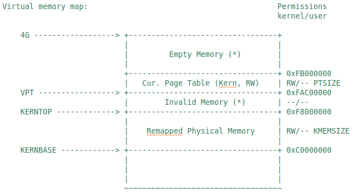
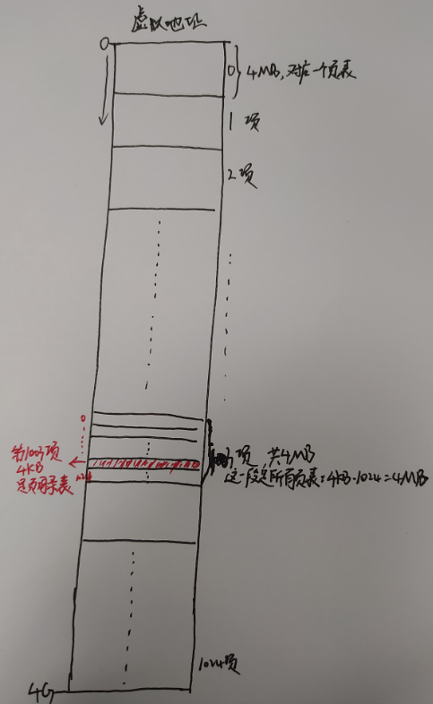
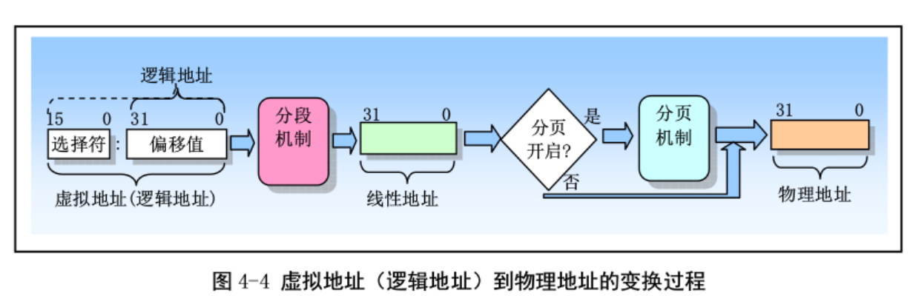

[TOC]

# 练习0 填写已有实验
lab1自己添加的注释过多,使用工具合并不方便 => 仅仅直接将答案复制过来,更多注释参考lab1代码

# 练习1:实现first-fit连续物理内存分配算法
作业结果见default_pmm.c
- **设计思路**  
first-fit设计思路比较简单,参考default_pmm.c中注释即可  

# 练习2:实现寻找虚拟地址对应的页表项
- **设计思路**  
详见pmm.c  

- **请描述页目录项(Page Directory Entry)和页表项(Page Table Entry)中每个组成部分的含义以及对ucore而言的潜在用处**  
对于一个32位的虚拟地址/线性地址(va/la),它可以分成三个部分:  
```
// +--------10------+-------10-------+---------12----------+
// | Page Directory |   Page Table   | Offset within Page  |
// |      Index     |     Index      |                     |
// +----------------+----------------+---------------------+
//  \--- PDX(la) --/ \--- PTX(la) --/ \---- PGOFF(la) ----/
//  \----------- PPN(la) -----------/
```
高10位是页目录项的索引,中间10位是页表项索引,最后12位是字节的索引;  
1.页目录项的编号就是上面的PDX,页目录项的内容是一个物理页号(就是二级页表的物理页号),通过这个物理页号可找到二级页表;  
2.页表项的编号就是上面的PTX,页表项的内容也是一个物理页号,通过这个物理页号可找到虚拟地址la对应的物理页;  
3.PGOFF则用于在2得到的物理页中找到具体的字节.  
```
【注:如何通过物理页号,找到物理页的描述信息Page结构体】
pmm.c中有全局变量pages,它是Page[]数组的虚拟地址,由于Page项是连续的,以pages为基址,加上(物理页号)*sizeof(Page) 即可得到该页的描述信息
```  

- **如果ucore执行过程中访问内存,出现了页访问异常,请问硬件要做哪些事情?**  
需要将引发异常的地址保存在cr2寄存器中,并设置错误代码,触发page fault异常,让操作系统在内核态进行处理.  
(cr2是页故障线性地址寄存器,保存最后一次出现页故障的全32位线性地址);  
(顺便,  
cr0寄存器保存一些标志位,包括保护允许位PE、分页位PG...等;  
cr1是未定义的控制寄存器，供将来的处理器使用;  
cr3寄存器保存页目录表的物理地址)  

# 练习3:释放某虚拟地址所在的页并取消对应二级页表项的映射  
- **设计思路**  
详见pmm.c

- **数据结构Page的全局变量(其实是一个数组)的每一项与页表中的页目录项和页表项有无对应关系?如果有,其对应关系是啥?**  
有对应关系!  
`任何物理页,都有一个Page项与之一一对应`.这个Page项描述了物理页的被引用次数,权限等信息.  
页目录项和页表项中都保存着一个物理页面的地址(物理页号).对于页目录项,这个物理页面是页表的地址;对于页表,这个物理页面表示已经分配的物理页;  
所以,任何一个的页目录项/页表项始终都对应有一个Page项,真实存在的物理页将Page项和页表(目录)项联系起来!  

- **如果希望虚拟地址与物理地址相等,则需要如何修改lab2,完成此事?**  
1.链接器kernel.ld中ucore的起始虚拟地址需要从0xC0100000 => 0x100000
2.memlayout.h中定义的KERNBASE需要从0xC0000000 => 0
3.entry.S中的页目录表中  
```
__boot_pgdir:
.globl __boot_pgdir 
# 1.map va 0 ~ 4M to pa 0 ~ 4M (temporary) 虚拟地址的0~4MB映射到物理地址的0~4MB => 这个映射只是临时的
.long REALLOC(__boot_pt1) + (PTE_P | PTE_U | PTE_W)       # 填写第一个页目录表项
.space (KERNBASE >> PGSHIFT >> 10 << 2) - (. - __boot_pgdir) # pad to PDE of KERNBASE => 填充页目录表项到KERNBASE处

# 2.map va KERNBASE + (0 ~ 4M) to pa 0 ~ 4M
.long REALLOC(__boot_pt1) + (PTE_P | PTE_U | PTE_W)       # 填写第xxx个页目录表项,与第一个页目录表项映射到同一段物理内存
.space PGSIZE - (. - __boot_pgdir) # pad to PGSIZE        # 页目录表至少占用4KB(PGSIZE),所以将其填充满
```
第一个映射不要取消,第二个映射需要取消!

# 补充:实验流程概述
ucore总控函数kern_init的代码,在lab2中有以下更改.首先,bootloader的工作有增加,在bootloader中,完成了对物理内存资源的探测工作,让ucore kernel在后续执行中能够基于bootloader探测出的物理内存情况进行物理内存管理初始化工作; 其次,bootloader不像lab1那样,直接调用kern_init函数,而是先调用位于lab2/kern/init/entry.S中的kern_entry函数.kern_entry函数的主要任务是为执行kern_init建立一个良好的C语言运行环境(设置堆栈),而且临时建立了一个段映射关系,为之后建立分页机制的过程做一个准备.完成这些工作后,才调用kern_init函数.  
kern_init函数在完成一些输出并对lab1实验结果的检查后,将进入物理内存管理初始化的工作,即调用pmm_init函数完成物理内存的管理.接着是执行中断和异常相关的初始化工作,即调用pic_init函数和idt_init函数等,这些工作与lab1的中断异常初始化工作的内容是相同的.  
为了完成物理内存管理,`首先需要探测可用的物理内存资源`;了解到物理内存位于什么地方,有多大之后,就`以固定页面大小来划分整个物理内存空间`,并准备以此为最小内存分配单位来管理整个物理内存,管理在内核运行过程中每页内存,设定其可用状态(free的、used的、还是reserved的),这其实就对应了连续内存分配概念和原理;接着ucore kernel就要`建立页表,启动分页机制`.让CPU的`MMU把预先建立好的页表中的页表项读入到TLB中`,根据页表项描述的虚拟页(Page)与物理页帧(Page Frame)的对应关系完成CPU对内存的读、写和执行操作.这一部分其实就对应了我们在课本上讲到内存映射、页表、多级页表等概念和原理.  

物理内存管理相关的总体控制函数是`pmm_init函数,它完成的主要工作`包括:  
```
初始化物理内存页管理器框架pmm_manager
建立空闲的page链表,这样就可以分配以页(4KB)为单位的空闲内存了;
检查物理内存页分配算法;
为确保切换到分页机制后,代码能够正常执行,先建立一个临时二级页表;
建立一一映射关系的二级页表;
使能分页机制;
重新设置全局段描述符表;
取消临时二级页表;
检查页表建立是否正确;
通过自映射机制完成页表的打印输出(这部分是扩展知识)
```
另外,主要注意的相关代码内容包括:  
1.boot/bootasm.S中探测内存部分(从probe_memory到finish_probe的代码);  
2.管理每个物理页的Page数据结构(在mm/memlayout.h中),这个数据结构也是实现连续物理内存分配算法的关键数据结构,可通过此数据结构来完成空闲块的链接和信息存储,而基于这个数据结构的管理物理页数组起始地址就是全局变量pages,具体初始化此数组的函数位于page_init函数中;  
3.用于实现连续物理内存分配算法的物理内存页管理器框架pmm_manager,这个数据结构定义了实现内存分配算法的关键函数指针;  
4.设定二级页表和建立页表项以完成虚实地址映射关系,这与硬件相关,且用到不少内联函数,源代码相对难懂一些.具体完成页表和页表项建立的重要函数是`boot_map_segment`函数,而`get_pte`函数是完成虚实映射关键的关键.  

# 补充:探测系统物理内存布局
## 概述
获取物理内存调用的方法有:BIOS中断调用、直接探测  
- **直接探测**  
必须在保护模式下完成  

- **BIOS中断调用**  
1.必须在实模式下完成;都是基于INT 15h中断,具体的有三种参数:88h、e801h、e820h  
2.linux kernel是依次尝试INT 15h中断的上述三种参数  
3.`ucore 是使用e820h,在bootloader进入保护模式之前调用此中断,并且将e820映射结构保存在地址0x8000处`  
**对"BIOS中断调用"的理解**:INT 15h对应的中断处理例程由BIOS实现; 这与os的ISR(中断服务例程)不同,此时os尚未加载！


## 探测物理内存分布和大小的方法
实模式下调用INT 15h中断,由BIOS的中断服务例程返回内存的详细信息.这些信息通过如下结构e820map描述(mm/memlayout.h):  
```
// 地址范围描述符(加了nr_map字段)
struct e820map {
    int nr_map; // 当前是第几个map,从0开始编号
    struct {   // 地址范围描述符
        uint64_t addr;          //基址,8byte
        uint64_t size;          //大小,8byte
        uint32_t type;          //类型,4byte
        /************************ 关于上面type的取值解释如下
         *  01h    memory, available to OS
         *  02h    reserved, not available (e.g. system ROM, memory-mapped device)
         *  03h    ACPI Reclaim Memory (usable by OS after reading ACPI tables)
         *  04h    ACPI NVS Memory (OS is required to save this memory between NVS sessions)
         *  other  not defined yet -- treat as Reserved
         * 
         * *************************************************************/
    } __attribute__((packed)) map[E820MAX];
};
```

**INT 15h BIOS中断的调用参数**(中断时需要设置这些寄存器)  
```
eax：功能码,当输入e820h时能够探测内存; ucore直接使用e820
edx：534D4150h (即4个ASCII字符"SMAP"),这只是一个签名而已;
ebx：如果是第一次调用或内存区域扫描完毕,则为0. 如果不是,则存放上次调用之后的计数值;
ecx：保存地址范围描述符的内存大小,应该大于等于20字节;
es:di：指向保存地址范围描述符结构的缓冲区,BIOS把信息写入这个结构的起始地址;
```
**INT 15h BIOS中断的返回结果**(返回结果在以下寄存器中)  
```
eflags的CF位:若INT 15中断执行成功,则不置位,否则置位
eax:534D4150h ('SMAP');
es:di：指向保存地址范围描述符的缓冲区,此时缓冲区内的数据已由BIOS填写完毕
ebx:下一个地址范围描述符的计数地址
ecx:返回BIOS往ES:DI处写的地址范围描述符的字节大小
ah：失败时保存出错代码
```
**综上**:我们通过`调用INT 15h BIOS中断,递增di的值(20的倍数),让BIOS帮我们查找出一个一个的物理内存布局entry,并放入到一个保存地址范围描述符结构e820map的缓冲区中,供后续的ucore进一步进行物理内存管理`  


## 实现物理内存探测(重要)
在进入保护模式之前,bootloader调用INT 15h中断;  
由BIOS响应这个中断,返回物理内存结构到地址0x8000处,详细代码如下:  
```
# ##########################  探测物理内存,lab1没有这部分!
probe_memory:
    movl $0, 0x8000      # 对0x8000处的的4字节置0 => 即将e820map结构体的nr_map字段置0; 注意此时处于实模式!
    xorl %ebx, %ebx
    movw $0x8004, %di    # INT 15h中断调用后,BIOS返回的地址范围描述符的起始地址(忽略了4字节的nr_map字段);见e820map结构体
start_probe:
    movl $0xE820, %eax   # 设置INT 15h中断调用的参数
    movl $20, %ecx       # 设置地址范围描述符的大小为20字节,其大小等于struct e820map的成员变量map的大小
    movl $SMAP, %edx     # 设置edx为534D4150h(即4个ASCII字符"SMAP"),这是一个约定
    int $0x15            # 调用int 0x15中断,要求BIOS返回一个用地址范围描述符表示的内存段信息(返回结果的地址为0x8004,已经存入%di)
    jnc cont             # 如果eflags的CF位为0,则表示还有内存段需要探测 => 跳转到cont,重新设置int 15h的返回地址,继续探测...; CF是进位标志
    movw $12345, 0x8000  # 探测有问题,结束探测
    jmp finish_probe
cont:
    addw $20, %di        # 设置下一个BIOS返回的映射地址描述符的起始地址
    incl 0x8000          # 递增struct e820map的成员变量nr_map
    cmpl $0, %ebx        # 如果INT0x15返回的ebx为零,表示探测结束,否则继续探测
    jnz start_probe
# ##########################  探测物理内存end,lab1没有这部分!
```
这段代码结束后,<font color=red>0x8000处便保存了物理内存分布的信息,这些信息按照e820map的结构组织;
ucore加载后,再使用这部分信息对物理内存进行关系</font>


# 补充:以页为单位管理物理内存
## 物理页的数据结构
- **物理页的数据结构**  
每个物理页(帧)用一个数据结构Page来表示,Page(memlayout.h)结构应尽可能小,从而节约内存  
```
// 描述物理页(帧)的结构体
struct Page {
    // 若某个页表项设置了某个虚拟页到这个物理页帧的映射,ref会+1
    int ref;                        
    //  flags有32bit,目前只用到两个bit
    // bit 0表示此页是否被保留 => bit 0 为1表示此页保留给操作系统使用;不能放到空闲页链表中
    // bit 1表示此页是否是free的 => bit 1为1表示此页free,可以被分配;否则表示已经分配了
    uint32_t flags;                 // => 见PG_property、 PG_reserved
    // 用于记录某连续物理内存空闲块的大小(个数),空闲块的第一个page才会使用这个字段!!
    unsigned int property;         
    // 双向链表,连接连续的物理内存空闲块,空闲块的第一个page才会使用这个字段!! 连接的是空闲块而不是页!
    list_entry_t page_link;        
};
```

- **管理空闲链表**  
`一个空闲块由多个frame(page)组成`,多个空闲块由双向链表链接成空闲链表;  
=> 空闲链表链接的是空闲块而不是空闲页帧;  
空闲链表由以下结构体描述  
```
typedef struct {
    list_entry_t free_list;         // the list header
    unsigned int nr_free;           // # of free pages in this free list
} free_area_t;
```

## 实现细节及内存布局
- **实现细节**  
大概就是`根据BIOS返回的物理内存信息,将ucore以上的部分区域用于存放Page结构体数组`;  
`Page结构体数组再往上的区域就是空闲物理内存,将这部分加入空闲链表`;  
....详见pmm.c page_init()函数  

- **关于lab2中的物理页管理**  
1.本实验只实现最简单的物理页内存管理算法.相应实现在defalut_pmm.c中的default_alloc_pages()和default_free_pages()函数  
2.实验2在内存分配和释放方面最主要的作用就是建立一个物理内存页管理框架,这实际上是一个函数指针列表(见pmm.h),如下:  
```
struct pmm_manager {
    const char *name;                                 // XXX_pmm_manager's name
    void (*init)(void);                               // initialize internal description&management data structure
                                                      // (free block list, number of free block) of XXX_pmm_manager 
    void (*init_memmap)(struct Page *base, size_t n); // setup description&management data structcure according to
                                                      // the initial free physical memory space 
    struct Page *(*alloc_pages)(size_t n);            // allocate >=n pages, depend on the allocation algorithm 
    void (*free_pages)(struct Page *base, size_t n);  // free >=n pages with "base" addr of Page descriptor structures(memlayout.h)
    size_t (*nr_free_pages)(void);                    // return the number of free pages 
    void (*check)(void);                              // check the correctness of XXX_pmm_manager 
};
```
实验2的重点就是实现上面的init_memmap、alloc_pages、free_apges三个函数  

- **内存布局**  
完成物理页内存管理初始化后,系统内存布局如下:  


# 补充:物理内存页分配算法实现(练习1)
本节主要描述First Fit的实现  
1.需要熟悉相关数据结构及其操作,详看./libs/list.h、free_area_t、pmm_manager等  
2.First Fit的实现需要重写default_init, default_init_memmap, default_alloc_pages, default_free_pages,详见./kern/mm/default_pmm.c ...略  
更多描述参考:[物理内存页分配算法实现](https://chyyuu.gitbooks.io/ucore_os_docs/content/lab2/lab2_3_3_4_phymem_allocation.html)

# 补充:实现分页机制(练习2、3)
## 段页式管理的基本概念
段式管理在lab1中已经学习,本节主要是在段的基础上分页  
- **段页式管理**  
x86体系结构将内存地址分为:`逻辑地址`(基址:偏移)、`线性地址`(一个数字,不过是虚拟的)、`物理地址`(一个数字,需要将其拆成几段来看=>页号、页内偏移...,且对应一个内存位置);  
逻辑地址就是程序指令中使用的地址,物理地址就是实际访问内存的地址;  
逻辑地址通过段式管理的地址映射得到线性地址;  
线性地址通过页式管理的地址映射得到物理地址;  
  
```
【注意】
段式管理只起到了一个过渡作用,它将逻辑地址不加转换直接映射成线性地址
由于ucore主要依靠页式管理
我们在下面的讨论中可以对逻辑、线性这两个地址不加区分(目前的 OS 实现也是不加区分的) => 很多os都是将段基址设置为0,所以偏移就是线性地址,因而没有必要区分...
```
- **分页机制管理**  
段页式管理中的分页机制详细情况如下:  
  
图中page directory其实就是一级页表;  
`一级页表的起始物理地址存放在cr3寄存器中`;  

## 系统执行中地址映射的三个阶段(重要)
### 概述
**lab1中的映射**:`lab1中的段映射是对等映射关系 => 物理地址和虚拟地址相等(通过让GDT中所有段的基址为0确定了对等映射关系)`;  
```
// lab1的kernel.ld中关于地址映射的部分
/* Load the kernel at this address: "." means the current address */
. = 0x100000;

.text : {
    *(.text .stub .text.* .gnu.linkonce.t.*)
}
```
=> `lab1中ld形成的ucore的起始虚拟地址从0x100000开始,由于是对等映射,所以ucore的起始物理地址也是0x100000,这个地址就是ucore的入口函数kern_init的地址`  
综上,lab1中,虚拟地址(逻辑地址)、线性地址、物理地址间的映射关系为:
```
virt addr=linear addr =phy addr
【附】:虚拟地址是一个有复杂的历史含义的东西,有人用于表示逻辑地址、有人用于表示线性地址 => 视情况而定,详见"相关要点/问题速览"第一个知识点
```

**lab2中的映射**:lab2中经过了较为复杂的地址映射  
```
// lab2的kernel.ld中关于地址映射的部分
/* Load the kernel at this address: "." means the current address */
. = 0xC0100000;
.text : {
    *(.text .stub .text.* .gnu.linkonce.t.*)
}
```
=> `lab2中ld形成的ucore的起始虚拟地址从oxC0100000开始,它是ucore入口函数kern_entry(见kern/init/entry.S,与lab1中ucore的入口函数不同)的起始虚拟地址`;  
但是,`实际上lab2和lab1一样,ucore都加载到起始物理地址0x100000处`;  
可见,lab1和lab2的地址映射不同.甚至,lab2在不同阶段,采用的地址映射方式也不同!!!  
**注意**:起始虚拟地址的变换,并不影响一般的跳转和函数调用,因为它们实际上是相对跳转;但是对于绝对寻址的全局变量引用,就需要使用REALLOC宏进行一些运算来确保地址是正确的(见entry.S)  
下面概述lab2中地址映射的三个阶段:  


### 第一阶段(开启保护模式,创建启动段表GDT)
第一阶段是bootloader阶段,即从bootloader的start()函数(见boot/bootasm.S)开始,到ucore的kern_entry()函数(见kern/init/entry.S)之前;  
这一阶段,虚拟地址(逻辑地址)、线性地址、物理地址之间的映射关系与lab1一样,即  
```
lab2 stage1: virt addr=linear addr =phy addr
```
这一阶段是bootloader在执行,虚拟地址等于物理地址(`且没有限制范围大小`)如图:  


### 第二阶段(创建初始页目录表,开启分页模式)
第二阶段为:从kern_entry()函数开始,到pmm_init()函数被执行前(见init/init.c);  
- **1**  
编译好的ucore自带了一个设置好的页目录表(一级页表)和相应的页表(二级页表),他们将0-4MB的线性地址一一映射到物理地址 => 页目录表的加载参考init/entry.S;  
- **2**  
加载页目录项后,进行使能分页机制,对应代码如下(见entry.S):  
```
movl %eax, %cr3                    # 将页目录表(一级页表)的起始地址存入cr3寄存器

# enable paging => 设置cr0的相应标志位,使能分页机制
movl %cr0, %eax
orl $(CR0_PE | CR0_PG | CR0_AM | CR0_WP | CR0_NE | CR0_TS | CR0_EM | CR0_MP), %eax
andl $~(CR0_TS | CR0_EM), %eax
movl %eax, %cr0
```
进入分页模式后,地址映射关系如下: => 这是由__boot_pgdir决定的,详见entry.S  
```
virt addr = linear addr = phy addr  //线性地址在0-4MB之内时,三者的映射关系
virt addr = linear addr = phy addr+0xC0000000  // 线性地址在0xC0000000~0xC0000000+4MB之间时...
```
这种映射方式,虚拟地址范围0~4MB以及KERNBASE~KERNBASE+4MB都映射到同一物理地址范围:0~4MB,真正能使用的物理地址空间很小;  
可见,这种映射限制了内核的大小,如果内核大于4MB(由于内核从0x100000开始编址,实际上ucore使用的只有3MB),可能导致打开分页之后,内核崩溃  
解决方法同样简单,就是正确填充更多的页目录项即可.  
- **3**  
此时的内核(eip)还在0-4MB的低虚拟地址区域运行;而最终,内核需要在虚拟地址高地址区域运行,低地址留给用户程序;  
=> 需要使用一个绝对跳转来使内核跳转到高虚拟地址,代码如下(见entry.S):  
```
# update eip
# now, eip = 0x1.....
leal next, %eax         # lea(load effective address)指令用来将一个内存地址赋给目的操作数
# set eip = KERNBASE + 0x1.....
jmp *%eax
```
跳转完毕后,通过把boot_pgdir[0]对应的第一个页目录表项(0-4MB)清零来取消了临时的页映射关系:  
```
# unmap va 0 ~ 4M, it's temporary mapping
xorl %eax, %eax
movl %eax, __boot_pgdir
```
最终,离开这个阶段时,逻辑地址、线性地址、物理地址的映射关系为(没有0~4MB(va) 到 0~4MB(pa)的映射): 
``` 
virt addr = linear addr = phy addr+0xC0000000 #线性地址在0xC0000000~0xC0000000+4MB之间时...
```
综上,`第二阶段的目的就是:更新映射关系的同时,将运行的内核(eip)从低虚拟地址迁移到高虚拟地址而不造成伤害`  
不过,目前能使用的物理地址空间仍然只有4MB,远远不够  

### 第三阶段(完善段表和页表)
第三阶段为:从pmm_init函数被调用开始;  
阶段二仅仅映射了物理地址的0~4MB,并不全面;并且对段表而言,缺少了运行ucore所需的用户段描述符以及TSS等  
pmm_init()函数完成以下工作:  
&nbsp;&nbsp;&nbsp;&nbsp;1.将页目录表项补充完整,从0-4MB扩充到0-KMEMSIZE;  
&nbsp;&nbsp;&nbsp;&nbsp;2.更新了段映射机制,使用了一个新的段表(包括内核态的断码段、数据段;以及用户态的代码段、数据段、TSS段);  
最终的虚拟地址(逻辑地址)、线性地址、物理地址映射关系:  
```
virt addr = linear addr = phy addr + 0xC0000000  #对所有线性地址
```
```
【详述】
从pmm_init函数被调用开始,pmm_init函数将页目录表项补充完成(从0~4M扩充到0~KMEMSIZE).然后,更新了段映射机制,使用了一个新的段表.这个新段表除了包括内核态的代码段和数据段描述符,还包括用户态的代码段和数据段描述符以及TSS(段)的描述符.理论上可以在第一个阶段,即bootloader阶段就将段表设置完全,然后在此阶段继续使用,但这会导致内核的代码和bootloader的代码产生过多的耦合,于是就有了目前的设计.
```

## 建立虚拟页和物理页帧的地址映射关系(重要)
### 概述
Intel 80386采用了`二级页表`来建立线性地址与物理地址之间的映射关系.由于我们已经具有了一个物理内存页管理器default_pmm_manager,支持动态分配和释放内存页的功能,我们就可以用它来获得所需的空闲物理页.在二级页表结构中,`页目录表占4KB空间`,可通过alloc_page函数获得一个空闲物理页作为页目录表(Page Directory Table，PDT).同理,ucore也通过这种类似方式获得一个`页表(Page Table，PT)所需的4KB空间`.  
整个页目录表和页表所占空间大小取决与二级页表要管理和映射的物理页数.假定当前物理内存0~16MB,每物理页(也称Page Frame)大小为4KB,则有4096个物理页,也就意味着有4个页目录项和4096个页表项需要设置.一个页目录项(Page Directory Entry,PDE)和一个页表项(Page Table Entry,PTE)占4B.即使是4个页目录项也需要一个完整的页目录表(占4KB).而4096个页表项需要16KB(即4096*4B)的空间,也就是4个物理页,16KB的空间.所以对16MB物理页建立一一映射的16MB虚拟页,需要5个物理页,即20KB的空间来形成二级页表.  

### 建立映射
完成前一节所述的前两个阶段的地址映射变化后,为把0~KERNSIZE(明确ucore设定实际物理内存不能超过KERNSIZE值,即0x38000000字节,896MB,3670016个物理页)的物理地址一一映射到页目录项和页表项的内容,其大致流程如下:  
- **1.指向页目录表的指针已存储在boot_pgdir变量中**  
- **2.映射0~4MB的首个页表已经填充好**  
- **3.调用boot_map_segment函数进一步建立一一映射关系**  
具体处理过程以页为单位进行设置,即  
```
linear addr = phy addr + 0xC0000000
```
设一个32bit线性地址la有一个对应的32bit物理地址pa,如果在以la的高10位为索引值的页目录项中的存在位(PTE_P)为0,表示缺少对应的页表空间,则可通过alloc_page获得一个空闲物理页给页表,页表起始物理地址是按4096字节对齐的,这样填写页目录项的内容为  
```
页目录项内容 = (页表起始物理地址 & ~0x0FFF) | PTE_U | PTE_W | PTE_P
```
进一步对于页表中以线性地址la的中10位为索引值对应页表项的内容为  
```
页表项内容 = (pa & ~0x0FFF) | PTE_P | PTE_W
```
- **4.注意PTE中几个bit的含义**  
PTE_U:位3,表示用户态的软件可以读取对应地址的物理内存页内容  
PTE_W:位2,表示物理内存页内容可写  
PTE_P:位1,表示物理内存页存在  

### 映射细节
ucore的内存管理经常需要查找页表:给定一个虚拟地址,找出这个虚拟地址在二级页表中对应的项.通过更改此项的值可以方便地将虚拟地址映射到另外的页上.可完成此功能的这个函数是get_pte函数.它的原型为:  
```
pte_t *get_pte(pde_t *pgdir, uintptr_t la, bool create)
```
`get_pte`涉及到三个类型pte_t、pde_t和uintptr_t.通过参见mm/mmlayout.h和libs/types.h，可知它们其实都是unsigned int类型.在此做区分,是为了分清概念.  
pde_t全称为 page directory entry,也就是一级页表的表项(注意:pgdir实际不是表项,而是一级页表本身.实际上应该新定义一个类型pgd_t来表示一级页表本身).  
pte_t全称为 page table entry,表示二级页表的表项.  
uintptr_t表示为线性地址,由于段式管理只做直接映射,所以它也是逻辑地址.  
pgdir给出页表起始地址.通过查找这个页表,我们需要给出二级页表中对应项的地址.虽然目前我们只有boot_pgdir一个页表,但是`引入进程的概念之后每个进程都会有自己的页表`.  

`有可能根本就没有对应的二级页表的情况`,所以二级页表不必要一开始就分配,而是等到需要的时候再添加对应的二级页表.如果在查找二级页表项时,发现对应的二级页表不存在,则需要根据create参数的值来处理是否创建新的二级页表.如果create参数为0,则get_pte返回NULL;如果create参数不为0,则get_pte需要申请一个新的物理页(通过alloc_page来实现,可在mm/pmm.h中找到它的定义).再在一级页表中添加页目录项指向表示二级页表的新物理页.注意,新申请的页必须全部设定为零,因为这个页所代表的虚拟地址都没有被映射.  
当建立从一级页表到二级页表的映射时,需要`注意设置控制位`.这里应该设置同时设置上PTE_U、PTE_W和PTE_P（定义可在mm/mmu.h）.如果原来就有二级页表,或者新建立了页表,则只需返回对应项的地址即可.`虚拟地址只有映射上了物理页才可以正常的读写`,在完成映射物理页的过程中,除了要象上面那样在页表的对应表项上填上相应的物理地址外,还要设置正确的控制位.  
`只有当一级二级页表的项都设置了用户写权限后,用户才能对对应的物理地址进行读写`.所以我们可以在一级页表先给用户写权限,再在二级页表上面根据需要限制用户的权限,对物理页进行保护.由于`一个物理页可能被映射到不同的虚拟地址上去(譬如一块内存在不同进程间共享)`,当这个页需要在一个地址上解除映射时,操作系统不能直接把这个页回收,而是要先看看它还有没有映射到别的虚拟地址上.这是通过查找管理该物理页的Page数据结构的成员变量ref(用来表示虚拟页到物理页的映射关系的个数)来实现的,如果ref为0了,表示没有虚拟页到物理页的映射关系了,就可以把这个物理页给回收了,从而这个物理页是free的了,可以再被分配.  
page_insert函数将物理页映射在了页表上.可参看page_insert函数的实现来了解ucore内核是如何维护这个变量的.当不需要再访问这块虚拟地址时,可以把这块物理页回收并在将来用在其他地方.取消映射由page_remove来做,这其实是page_insert的逆操作.  

建立好一一映射的二级页表结构后,由于分页机制在前一节所述的前两个阶段已经开启,分页机制到此初始化完毕.当执行完毕gdt_init函数后,新的段页式映射已经建立好了.在pmm_init函数建立完实现物理内存一一映射和页目录表自映射的页目录表和页表后,ucore看到的内核虚拟地址空间如下图所示:  
  


# 补充:链接脚本及其中各符号的解读
```
/* Simple linker script for the ucore kernel.
   See the GNU ld 'info' manual ("info ld") to learn the syntax. */

/********************* 备注 **************************
* 1. "."表示当前地址
* 2. .ld文件中定义的edata[]、end[]是全局变量,会在部分源代码中引用(init.c),他们表示相应段的起始或结束地址
* 3. elf三类文件格式参考csapp第七章
*****************************************************/


OUTPUT_FORMAT("elf32-i386", "elf32-i386", "elf32-i386")
OUTPUT_ARCH(i386)       /* cpu类型 */
ENTRY(kern_entry)       /* 程序入口*/

SECTIONS {
    /* Load the kernel at this address: "." means the current address */
    . = 0xC0100000;      /* 内核被链接到从这个虚拟地址开始的虚拟地址空间 */
    .text : {            /* .text 表示代码段起始地址 */
        *(.text .stub .text.* .gnu.linkonce.t.*)
    }

    PROVIDE(etext = .); /* Define the 'etext' symbol to this value */

    .rodata : {
        *(.rodata .rodata.* .gnu.linkonce.r.*)
    }

    /* Include debugging information in kernel memory */
    .stab : {
        PROVIDE(__STAB_BEGIN__ = .);
        *(.stab);
        PROVIDE(__STAB_END__ = .);
        BYTE(0)     /* Force the linker to allocate space
                   for this section */
    }

    .stabstr : {
        PROVIDE(__STABSTR_BEGIN__ = .);
        *(.stabstr);
        PROVIDE(__STABSTR_END__ = .);
        BYTE(0)     /* Force the linker to allocate space
                   for this section */
    }

    /* Adjust the address for the data segment to the next page */
    . = ALIGN(0x1000);

    /* The data segment */
    .data : {
        *(.data)
    }

    . = ALIGN(0x1000);
    .data.pgdir : {
        *(.data.pgdir)
    }

    PROVIDE(edata = .);  /* edata代表数据段的结束地址 */

    .bss : {            /* .bss也是数据段的结束地址,同时还是BSS段的起始地址*/
        *(.bss)
    }

    PROVIDE(end = .);  /* end 是BSS段的结束地址*/

    /DISCARD/ : {
        *(.eh_frame .note.GNU-stack)
    }
}
```
.ld文件中给出的地址是ucore内的的链接地址 == ucore内核的虚拟地址;  
bootloader加载ucore内核用到的加载地址 == ucore内核的物理地址; (这一条详见bootmain.c)


# 补充:ucore采用的自映射机制(难懂)
这部分比较难懂,可参考:[自映射机制](https://chyyuu.gitbooks.io/ucore_os_docs/content/lab2/lab2_3_3_6_self_mapping.html)  
[页表自映射(推荐阅读)](https://blog.csdn.net/u010513059/article/details/80311248?utm_medium=distribute.pc_relevant.none-task-blog-BlogCommendFromMachineLearnPai2-1.control&dist_request_id=1328656.12411.16158988802370289&depth_1-utm_source=distribute.pc_relevant.none-task-blog-BlogCommendFromMachineLearnPai2-1.control)  
原理如图:  
上图中,红色区域是页目录表,有:
```
1.页目录表包含1024项,每项对应一个页表;  
2.如上图,页目录表的第1003项(未画出来)对应图中红色的page,即页目录表;  
3.这个红色的page恰好是1024个页表中的第1003个;  
4.红色page所在区域恰好是1024个4MB区域中的第1003个...
```
简言之,将页目录表放到一个连续的页表区域中,而这个页表区域又是虚拟地址空间中4MB对齐的,而且满足关系:`若页表区域是虚拟地址空间的第x个区域,则页目录表是页表区域中第x个页,且页目录表所在页对应页目录表的第x项`.自映射的作用:为每个进程节省了4K的虚拟空间(不用单独分配页目录表),同时页目录表和页表都放在了地址空间里面,通过虚拟地址来统一操作页面映射.  

## 为什么需要自映射
通过boot_map_segment函数(见pmm.c)建立了基于一一映射关系的页目录表项和页表项,这里的映射关系为:  
```
virtual addr (KERNBASE~KERNBASE+KMEMSIZE) = physical_addr (0~KMEMSIZE)
```  
这样只要给出一个虚地址和一个物理地址,就可以设置相应PDE和PTE,就可完成正确的映射关系;  
`如果我们这时需要按虚拟地址的地址顺序显示整个页目录表和页表的内容,则要查找页目录表的表项内容,根据页目录表项内容找到页表的物理地址,再转换成对应的虚地址,然后访问页表的虚地址,搜索整个页表的每个页目录项`.这样过程比较繁琐.  
我们需要有一个简洁的方法来实现这个查找.ucore做了一个很巧妙的`地址自映射`设计 => 把页目录表和页表放在一个连续的4MB虚拟地址空间中,并设置页目录表自身的虚地址<==>物理地址映射关系.这样在已知页目录表起始虚地址的情况下,通过连续扫描这特定的4MB虚拟地址空间,就很容易访问每个页目录表项和页表项内容.  

## ucore自映射的实现
- **1.设置常量VPT**  
在memlayout.h中定义常量`VTP=0xFAC00000`,对应的二进制表示为 `1111 1010 1100 0000 0000 0000 0000 0000`  
注意这个虚拟地址的高10位为1003,中10位为0,低12位也为0!  

- **2.映射页表**  
在pmm.c中设置两个全局变量  
```
// 32位整数 => vpt就代表了页表(二级页表)的起始虚拟地址(也就是一级页表中第一个表项指向的页表的虚拟地址)
pte_t * const vpt = (pte_t *)VPT;
// vpd=0xFAFEB000,它是页目录表(一级页表)的起始虚拟地址,其高10bit和中10bit都是1003  
pde_t * const vpd = (pde_t *)(PGADDR(PDX(VPT), PDX(VPT), 0));  
```  
且在pmm_init()函数中执行:  
```
// 设置页表(所有页表,共4MB)对应的页目录表项!!!
boot_pgdir[PDX(VPT)] = PADDR(boot_pgdir) | PTE_P | PTE_W; 
```  

- **3.print_pgdir()打印页表内容**  
执行结果:
```
PDE(0e0) c0000000-f8000000 38000000 urw          
  |-- PTE(38000) c0000000-f8000000 38000000 -rw
PDE(001) fac00000-fb000000 00400000 -rw
  |-- PTE(000e0) faf00000-fafe0000 000e0000 urw
  |-- PTE(00001) fafeb000-fafec000 00001000 -rw
```  
其中`PDE(0e0) c0000000-f8000000 38000000 urw`表示:  
1.页目录表中相邻的224(0e0)项具有相同权限;  
2.这224项映射的虚拟地址范围是c0000000-f8000000;  
3.虚拟地址大小为0x38000000(共896MB,恰好与224项对应,224*4MB);  
4.具体权限为urw(存在,用户可读、可写)  
同理可得`PDE(001) fac00000-fb000000 00400000 -rw`...这一段恰好是所有页表(4MB)对应的页目录表项  

- **4.用户程序通过自映射机制访问页表**  
自映射机制还可方便用户态程序访问页表.因为页表是内核维护的,用户程序很难知道自己页表的映射结构,VPT 实际上在内核地址空间的,我们可以`用同样的方式实现一个用户地址空间的映射(比如 pgdir[UVPT] = PADDR(pgdir) | PTE_P | PTE_U`,注意,这里不能给写权限,并且 pgdir 是每个进程的 page table,不是 boot_pgdir).这样,用户程序就可以用和内核一样的 print_pgdir 函数遍历自己的页表结构了


# 相关要点/问题速览
- **区分:逻辑地址、虚拟地址、线性地址、物理地址**  
几个地址间的转换关系如图:  
  
逻辑地址 => 线性地址 => 物理地址 这三个毫无争议; 关键在于虚拟地址  
`虚拟地址的原始定义`:虚拟地址原本就是指逻辑地址(base:offet)  
`虚拟地址的常用含义`:不过,`在os内核以及很多场合,虚拟地址都是指的线性地址`  
综上:虚拟地址的指代视情况而定,称呼不重要,明白三个地址间的转换即可  


- **如何将Page结构体数组放到指定位置(它需要紧接在ucore内核代码后)?**  
kernel.ld中有全局变量end,它就是ucore代码结束的位置;  
page_init(pmm.c)函数在end地址往上保留了npage个Page结构的空间没有占用,这部分就是Page结构体数组的区域...

- **如何根据空闲双向链表节点获取对应的物理页?**  
关键在于所有的Page项通过page_link字段构成了一个伪链表!!!  
1.双向链表结点对应Page结构的page_link字段,根据结点的虚拟地址va可转换得到Page的指针(va地址);  
2.Page项的虚拟地址-Page[]数组的基址=该页的编号,这就是物理页号....  

- **如何在建立页表的过程中维护页表和GDT的关系,确保ucore能够在各时间段上正常寻址?**  
entry.S处于地址映射的第二阶段,这个时候使用bootloader设置的栈和段表GDT,且建立了简单的页目录表(__boot_pgdir)和页表(__boot_ptr1);  
这时候虽然只映射了4MB的物理内存,但是代码并不多,使用上述的GDT、页表就已经可以满足当前工作;  
为了满足后续的需求:1.在entry.S中最开始有两段虚拟地址都映射到物理地址0~4MB,之后完成了虚拟地址的平滑迁移; 2.在pmm.c的pmm_init()中调用boot_map_segment(...)时完善了页目录表、页表,从而可满足后续工作....

- **哪些物理内存空间需要建立页映射关系?**  
目前lab2而言,根据boot_map_segment函数(pmm.c下pmm_init调用),物理地址0~0x38000000都需要映射,他们映射到虚拟地址KERNBASE~KERNBASE+0x38000000  
疑问:比KERNBASE+0x38000000更高的虚拟地址空间VPT(0xFAC00000)往上是页表,这部分映射到了哪段物理内存呢??  


- **具体的页映射关系是什么?**  
详见上文笔记:"地址映射的三个阶段"...  

- **页目录表的起始地址设置在哪里?**  
页目录表的起始地址不是一个指定的地址,在编译确定(在entry.S),通过对全局变量__boot_pgdir取地址可得到页目录表的起始地址(va/la);  
(上面说的是虚拟地址,至于其物理地址pa,根据映射规则用va计算即可)  

- **页表的起始地址设置在哪里,需要多大空间?**  
根据memlayout.h,页表的起始虚拟地址为VPT(0xFAC00000),大小为4MB，包含了所有二级页表(1K个二级页表,共1MB个二级页表项)  

- **如何设置页目录表项的内容?**  
1.在entry.S中先设置了两个页目录表项,然后为了平滑的迁移到高虚拟地址,撤销了第一个页目录表项(低4MBva 映射到低 4MBpa),仅保留KERNBASE往上4MB虚拟空间到0~4MB的物理地址的映射;  
2.在pmm.c中pmm_init调用了boot_map_segment()函数将虚拟地址KERNBASE往上KMEMSIZE的虚拟地址空间映射到0~KMEMSIZE的物理地址空间,这个过程中会自动填充页目录表项  


- **如何设置页表项的内容?**  
在entry.S中填充的第一个二级页表的所有页表项,并且设置了其对应的页目录表项;  
在pmm.c中pmm_init调用了boot_map_segment()函数将虚拟地址KERNBASE往上KMEMSIZE的虚拟地址空间映射到0~KMEMSIZE的物理地址空间,这个过程中会自动填充页表项  

- **entry.S中内栈那样设置的依据(为何ebp设置为0,为何内核栈填充满之后才设置esp)?**  
1.bootloader中设置的栈只用临时的,进入ucore后需要重新设置内核自己的栈;  
2.ebp只是用于标志栈的位置,按理说这里不设置成0也行.假设设置成A,那么之后查看调用栈时通过判断栈帧中的ebp数据是否为A确定到栈底没有;  
3.虽然:  
```
bootstack:
    .space KSTACKSIZE
    .globl bootstacktop
bootstacktop:
...
movl $bootstacktop, %esp
```
确实是先填充了8KB的内核栈,但是由于栈是往下正常的,esp中保存的是高地址 => esp依然是当前栈的最底部!!!之后调用函数时往低地址bootstack增长  


- **页目录表__boot_pgdir在哪里?页表在哪里?**  
页目录表在内核代码中(va);  
页表(二级页表)在0xFAC00000往上的4MB范围内(va)=> 共1MB个页表项,恰好对应4GB物理内存  

- **对于struct Page* page;计算page对应物理页号的原理??**  
参见pmm.h,page2pa()函数  
解释:pmm.c中全局变量pages是Page[]数组的基址,指针page-指针pages可得到该页的编号(物理页号)  


- **bootmain中读取第一个page时,为什么是读取到虚拟/物理地址0x10000处?**  
这是规定(虽然改用另一个类似的地址也行),如图:  
  
这图是物理内存的布局,在bootmain中地址映射规则还处于=> 0~1MB(va) 映射到 0~1MB(pa),读取到虚拟地址0x10000就是读取到物理内存0x10000处;  
这样保证了ucore的ELF hdr在bootloader往上,且给bootloader代码留足了空间  

- **cr3寄存器**  
`存放页目录表的物理地址`;  
同时,在ucore中,全局变量boot_cr3也用于记录页目录表的物理地址  


- **为什么page_init()函数(见pmm.c)中只设置了内核占用空间(KERNBASE~KERNBASE+KMEMSIZE)的Page[]结构体数组,如果是用户代码怎么管理呢?**  
??

- **如何理解自映射机制**  
见上文"ucore采用的自映射机制",3.16有更新,算是讲清除了自映射机制

- **pmm_init()中 boot_pgdir[PDX(VPT)] = PADDR(boot_pgdir) | PTE_P | PTE_W;的作用?**  
原本是相进行自映射的,不过从结果来看,并非真正的自映射,这条语句算是作了一个没有意义的映射...

- **slob分配算法**  
实现详见kmalloc_init()代码(lab2中没有,可在lab8中mm目录下查看)  


- **pmm.c中,boot_map_segment存在的问题!**  
```
按照道理说是:对于一个虚拟地址la,先通过物理内存管理器分配一块物理页pa,然后填写页表完成(la,pa)的映射,正如pgdir_alloc_page()所做的那样;
但是boot_map_segment()比较奇特,它直接填写了部分页表(完成了KERNBASE~KERNBASE+MEMSIZE这段虚拟空间到0~MKEMSIZE这段物理空间的映射),但是并没有分配物理内存
    这就导致:1.内核如果直接访问KERNBASE~KERNBASE这段虚拟地址,那么访问的是物理地址0~MKEMSIZE;
            2.但是内核中有的代码又是动态内存分配获得物理内存,而他们分配的仍然是0~MKEMSIZE这段物理空间,然后填写页表;
            所以1和2可能发生冲突,即内核页表中有两个虚拟地址映射到了同一个物理地址...
```